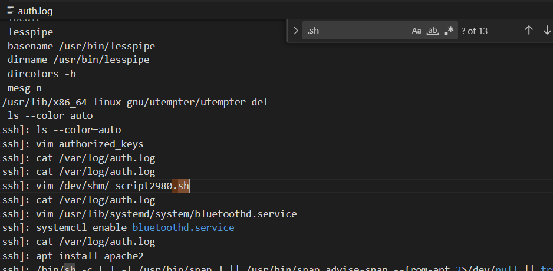

# Red Team Activity 1
> Q1: what was the script name that was dropped?

> Note: Flag format is RS{MD5sum(<answer string>)}

## About the Challenge
We have been given a log file (You can download the file [here](auth.log)) and we need to find the script name

## How to Solve?
To do this, I attempted to search the log file using the keyword `.sh`, and discovered a strange script named `_script2980.sh`.



Hash the script name using `md5sum`. Here is the command

```shell
echo -n _script2980.sh | md5sum
```

And then wrap the output with `RS{.*}`

```
RS{5d8b854103d79677b911a1a316284128}
```