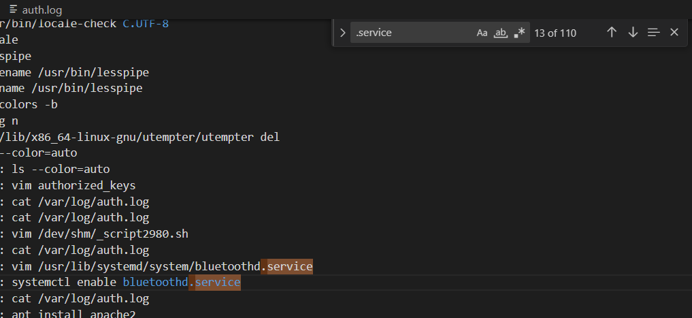

# Red Team Activity 2
> Q2: Name of the malicious service?

> Note: Flag format is RS{MD5sum(<answer string>)}

## About the Challenge
We have been given a log file (You can download the file [here](auth.log)) and we need to find the malicious service

## How to Solve?
To do this, I attempted to search the log file using the keyword `.service`, and discovered a strange service named `bluetoothd.service`

That's because there is a `vim` command executed before enable the service, So the user creating `bluetoothd.service` in the `/usr/lib/systemd/system/` directory to convince that is a legit service.



Hash the service name using `md5sum`. Here is the command

```shell
echo -n bluetoothd.service | md5sum
```

And then wrap the output with `RS{.*}`

```
RS{a9f8f8a0abe37193f5b136a0d9c3d869}
```