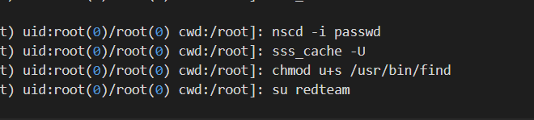

# Red Team Activity 4
> Q4: Which binary (full path to binary) was modified by redteam to later escalate privileges?

> Note: Flag format is RS{MD5sum(<answer string>)}

## About the Challenge
We have been given a log file (You can download the file [here](auth.log)) and we need to find the binary files to do privilege escalation

## How to Solve?
To do this, I attempted to search the log file using the keyword `su redteam` to find the `redteam` user first


As you can see before `redteam` user became `root` that user running this command

```shell
find . -exec /bin/sh -p ; quit
```

If we check on [GTFOBins](https://gtfobins.github.io/gtfobins/find/). That command used to spawn shell or to do privilege escalation. Before `root` user login to as `redteam` that user change the SUID permission so non-root user such as `redteam` can use that file to do privilege escalation



Hash the binary name using `md5sum`. Here is the command

```shell
echo -n /usr/bin/find | md5sum
```

And then wrap the output with `RS{.*}`

```
RS{7fd5884f493f4aaf96abee286ee04120}
```