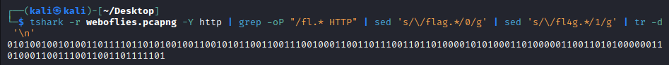
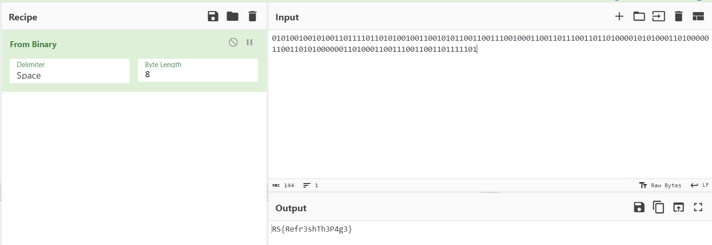

# Web of Lies
> We found more weird traffic. We're concerned he's connected to a web of underground criminals.

## About the Challenge
We have been given a `pcapng` file (You can download the file [here](weboflies.pcapng)). And here is the preview


There are a lot of requests to `/flag` and `/fl4g` endpoints

## How to Solve?
As there were only requests to the `/flag` and `/fl4g` endpoints, I decided to represent them in binary code. Therefore, `/flag` is equivalent to 0 and `/fl4g` is equivalent to 1.

```shell
tshark -r weboflies.pcapng -Y http | grep -oP "/fl.* HTTP" | sed 's/\/flag.*/0/g' | sed 's/\/fl4g.*/1/g' | tr -d '\n'
```

To easier myself, im using `tshark` command to print all the HTTP packet, and then change them to binary code using `sed` command



Use binary code translator to obtain the flag



```
RS{Refr3shTh3P4g3}
```