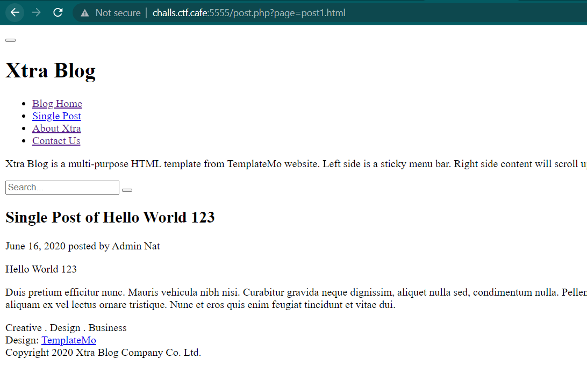
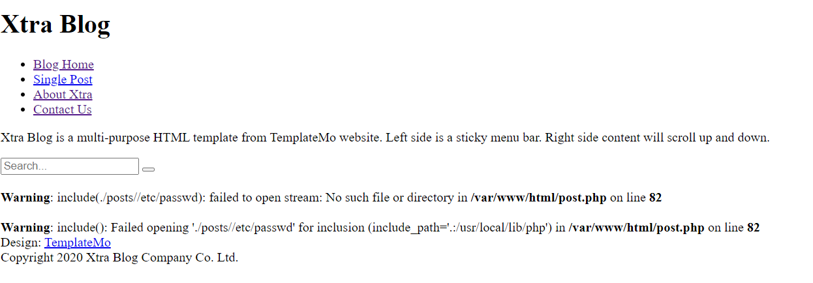
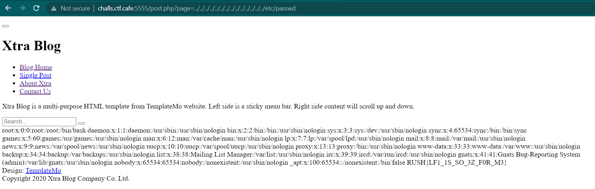

# Blog
> Hey what do you think about my blog?

## About the Challenge
We have been given a plain website that contains a blog


## How to Solve?
If we check one of the post, the endpoint will looks like this



```
http://challs.ctf.cafe:5555/post.php?page=post1.html
```

So I tried to to change the `post1.html` value to another file, for example `/etc/passwd`.



Unfortunately, we can't check the `passwd` file because we still inside the `posts` directory. We can use `../` or dot dot slash to go to `/` directory and then read the `passwd` file



```
RUSH{LF1_1S_SO_3Z_F0R_M3}
```