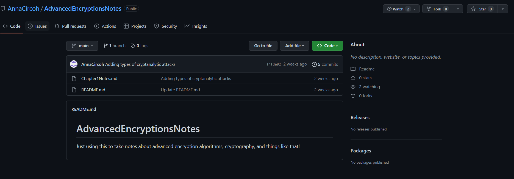

# Paper? Digital? same diff to me

> Two of our members, Simon and Anna were arguing about where's better to take notes.

> Simon thinks that Github isn't the best place to take your notes because you might leave something public behind by accident, like maybe a note about someone you didn't want public.

> Anna disagrees because you can just delete it and recommit anyway, and it looks good to be active on Github!

> Simon reminded them that we can see the changes... even what they wrote about Tom.

> Anna rushed off, but now we're not sure what they're talking about. Could you figure it out?

## About the Challenge
We need to find the flag by doing an OSINT

## How to Solve?
In the description it stated we need to find the flag on GitHub. First I went to [NJITCC GitHub](https://github.com/NJITICC) and then in the `People` section there are 2 members


I check `AlfredSimpson` account first but I found nothing. And then I decided to check the account and that account just have 1 repository named `AdvancedEncryptionsNotes`



I checked the commits list and there is a flag in 1 of the commits

https://github.com/AnnaCircoh/AdvancedEncryptionsNotes/commit/5937685a0a9e0a42563279a5198574cac1b04a7c


```
nicc{t0m_is_@cting_w3ird}
```