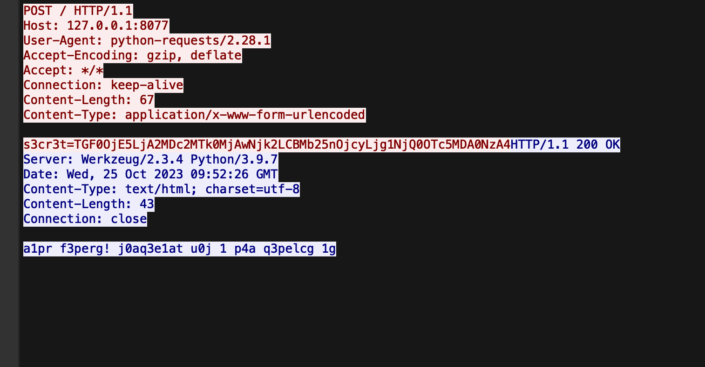
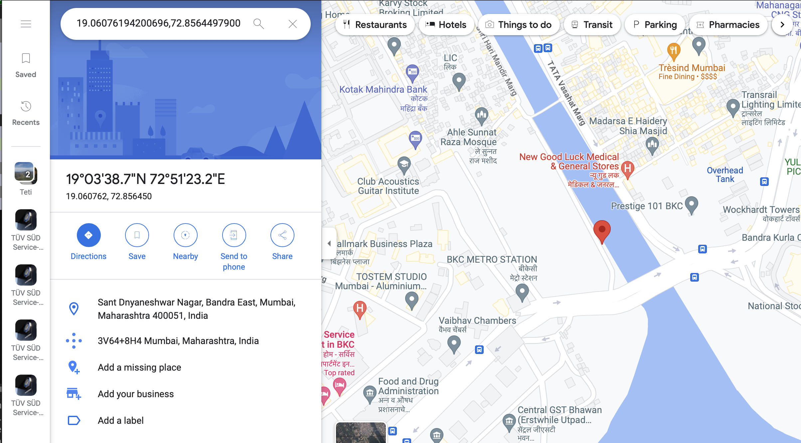
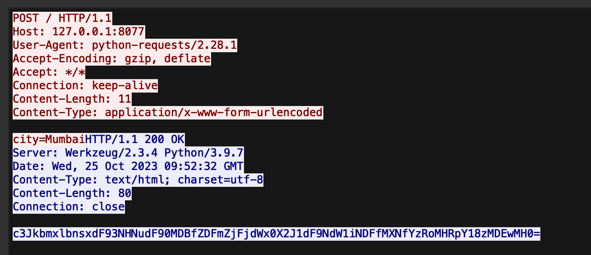

# Urban Odissey
> I can't remember the city where I lost my trail. Can you help me find my secret map of the treasure?

## About the Challenge
We were given a `pcapng` file that contains a lot of requests about city (You can download the file [here](urban_odissey.pcapng))

## How to Solve?
When I analyzed the file, there is 1 unusual HTTP request like the image below:



When I tried to decode the string, the result was the latitude and longitude of a location



Now, let's find `Mumbai` inside the `pcapng` file and there is 1 HTTP request that contains that string



Decode the body response using `Base64` encoding

```
srdnlen{1t_w4snt_t00_d1ff1cult_but_Mumb41_1s_c4h0tic_30100}
```