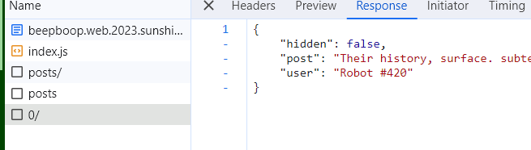

# BeepBoop Blog
> A few robots got together and started a blog! It's full of posts that make absolutely no sense, but a little birdie told me that one of them left a secret in their drafts. Can you find it?

## About the Challenge
We were given a website. Here is the preview of the website


If we check one of the details of the post it will look like this


## How to Solve?
If we check the `Network` tab in chrome, there are 2 endpoints

- /posts/
- /post/[0-9]/



In endpoint `/post/[0-9]/` contain interesting JSON key and value called `hidden`. Almost all posts on this site set the `hidden` JSON key value to `false`. And if we check the description

```
but a little birdie told me that one of them left a secret in their drafts
```

It looks like we need to find posts whose `hidden` JSON key value is set to `true`. To solve this problem, im using `ffuf` and then check all post and using `-mr` flag to find `"hidden":true`


Hmmm, lets check the post by hitting `/post/608/` endpoint


```
sun{wh00ps_4ll_IDOR}
```