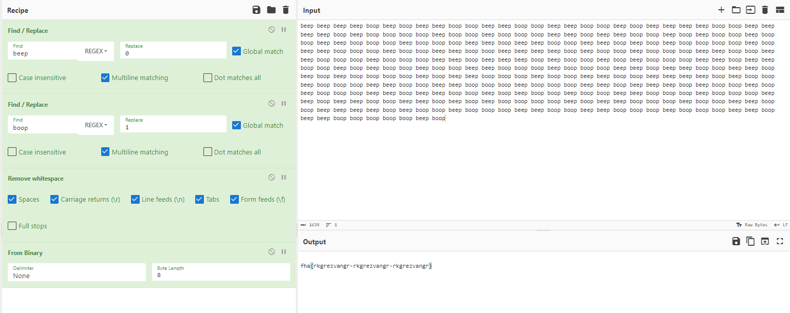
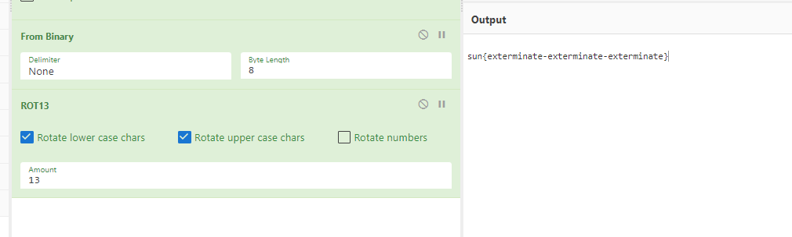

# BeepBoop Cryptography
> Help! My IOT device has gone sentient!
> All I wanted to know was the meaning of 42!

> It's also waving its arms up and down, and I...

> oh no! It's free!

> AAAAAAAAAAAAAAAAAAAAAAAAAAAAAAAAAAA

> Automated Challenge Instructions
> Detected failure in challenge upload. Original author terminated. Please see attached file BeepBoop for your flag... human.

## About the Challenge
We got a file called `BeepBoop` and in this file there are only 2 words, `beep` and `boop`

```
beep beep beep beep boop beep boop beep beep boop boop beep beep boop boop beep beep boop boop beep boop beep beep beep beep boop boop beep beep beep beep boop beep boop boop boop boop beep boop boop beep boop boop boop beep beep boop beep beep boop boop beep boop beep boop boop beep boop boop beep beep boop boop boop beep boop boop boop beep beep boop beep beep boop boop beep beep boop beep boop beep boop boop boop boop beep boop beep beep boop boop boop beep boop boop beep beep boop boop beep beep beep beep boop beep boop boop beep boop boop boop beep beep boop boop beep beep boop boop boop beep boop boop boop beep beep boop beep beep beep boop beep boop boop beep boop beep boop boop boop beep beep boop beep beep boop boop beep boop beep boop boop beep boop boop beep beep boop boop boop beep boop boop boop beep beep boop beep beep boop boop beep beep boop beep boop beep boop boop boop boop beep boop beep beep boop boop boop beep boop boop beep beep boop boop beep beep beep beep boop beep boop boop beep boop boop boop beep beep boop boop beep beep boop boop boop beep boop boop boop beep beep boop beep beep beep boop beep boop boop beep boop beep boop boop boop beep beep boop beep beep boop boop beep boop beep boop boop beep boop boop beep beep boop boop boop beep boop boop boop beep beep boop beep beep boop boop beep beep boop beep boop beep boop boop boop boop beep boop beep beep boop boop boop beep boop boop beep beep boop boop beep beep beep beep boop beep boop boop beep boop boop boop beep beep boop boop beep beep boop boop boop beep boop boop boop beep beep boop beep beep boop boop boop boop boop beep boop
```

## How to Solve?
The first thing that came to my mind when I saw this file was binary code. The word `beep` may represent the number 0 and `boop` may represent the number 1



Hmmm the output was `fha{rkgrezvangr-rkgrezvangr-rkgrezvangr}`.It looks like we need to shift the characters using `ROT13`



```
sun{exterminate-exterminate-exterminate}
```