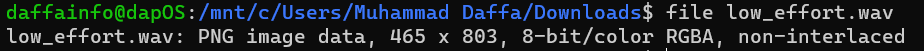
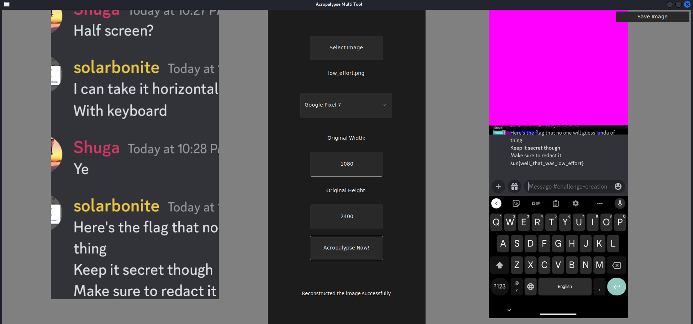

# Low Effort Wav 🌊
> Last year we went all-out and created a JXL file that had too much data.

> That was too much effort. Shuga had to go and create a custom file that was altered, that's too much work, and is too passé. Also an astounding 286 guesses were made against 9 correct answers. That was too many.

> This year, we used an already existing vulnerability (edit: aaaaaaaaaand it's patched, and like a day after we made this challenge... which was months ago), for minimum effort. And the flag, dude, is like, fully there, when you find it. Not half there. No risk of guessing.

> This year, we introduce:

> The low-effort wave 🌊
> Ride the wave man. 🏄‍♂️🏄‍♀️🌊

> The wave is life. The waves are like, sound, and like water, and like cool and refreshing dude.

> But waves are hard to ride
> So listen to them instead, crashing on the seashore. Listen to the music of the sea. Like the theme this year is music or something. So I theme this challenge, like, minimum effort music. Listen to this attached .wav file. It's amazing. Or so I've heard. Or rather, haven't. Something's broken with it. I don't know dude.

> It also doesn't work. Can you fix this for me? I think there's a flag if you can find it.

> Hints
> There will be no hints given for this challenge by judges. The flag is in standard sun{} format. If anything, we've already given you too much data.

## About the Challenge
We got a file called `low_effort.wav` and if we run `file` command:



And if we run `exiftool` command:


There are an interesting information like `Warning : [minor] Trailer data after PNG IEND chunk` and `Unique Camera Model : Google Pixel 7`

## How to Solve?
To get the flag, I took advantage of [CVE 2023-21036](https://en.wikipedia.org/wiki/ACropalypse), which is a vulnerability in Markup (Screenshoot editing tool in Google Pixel). And im using this [tool](https://github.com/frankthetank-music/Acropalypse-Multi-Tool) to recover cropped image



```
sun{well_that_was_low_effort}
```