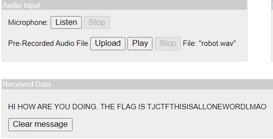

# beep-boop-robot
> beep boop, it sounds like a robot. sus.....

## About the challenge

We have given about .wav file called `robot.wav`, which is if you play it sounds like morse code. (You can download it [here](file/robot.wav))

## How to Solve

We can use tool on [DataBorder Morse Decoder](https://databorder.com/transfer/morse-sound-receiver/). You just need upload the wav file and press `Play`



Since the flag format is lowercase so the flag is

```
tjctf{thisisallonewordlmao}
```