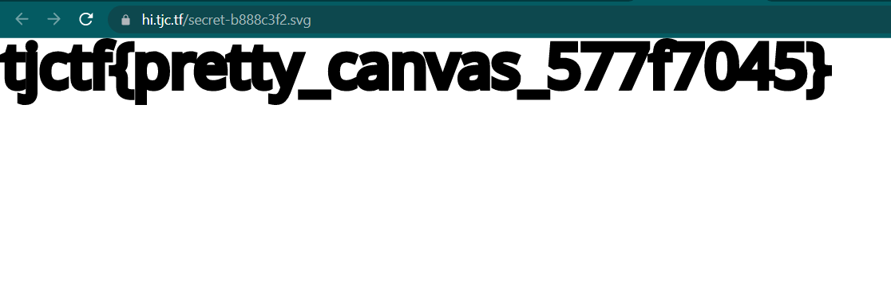

# hi
> hi

## About the Challenge
We have been given a website with no source code and if we open the website, the website is only black and white


## How to Solve?
If we check the source code of the website by pressing `CTRL + U`, there is a SVG file called `secret-b888c3f2.svg`. Open that file and you will obtain the flag




```
tjctf{pretty_canvas_577f7045}
```