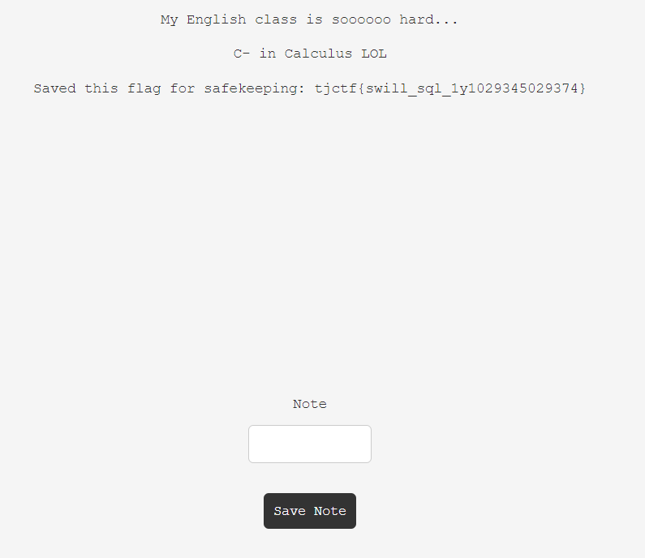

# swill-squill
> ezsql

## About the Challenge
We have been given a website and a source code. (You can download the source code [here](server.zip))


There is a register functionality and also we can store our note into the website.

## How to Solve?
If you check the source code, in the `/register` route:

```python
@app.route('/register', methods=['POST'])
def post_register():
    name = request.form['name']
    grade = request.form['grade']

    if name == 'admin':
        return make_response(redirect('/'))

    res = make_response(redirect('/api'))
    res.set_cookie("jwt_auth", generate_token(name))

    c = conn.cursor()
    c.execute("SELECT * FROM users WHERE name == '"+name+"';")

    if c.fetchall():
        return res

    c = conn.cursor()
    c.execute('INSERT INTO users VALUES (?, ?)',
              (name, grade))
    conn.commit()

    return res
```

There is a SQL injection vulnerability in `name` parameter, why? Check this line

```python
@app.route('/register', methods=['POST'])
def post_register():
    name = request.form['name']
    ...
    c = conn.cursor()
    c.execute("SELECT * FROM users WHERE name == '"+name+"';")
```

There is no filter in the `name` parameter so we can input `' or true--` on the form to obtain the flag.



```
tjctf{swill_sql_1y1029345029374}
```