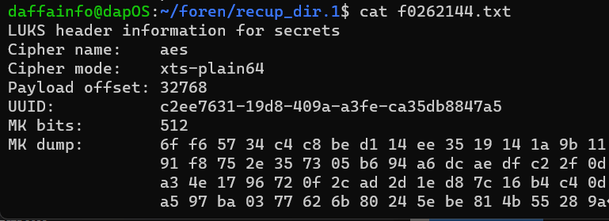

# Lost Evidence
> Someone hacked into our system and deleted most of the evidence we have against a certain group. All we have left is this seemingly random dump of garbage. See if you can uncover any secrets it may contain.

## About the Challenge
We were given a file called `lost_evidence` and we need to find the flag in this file

## How to Solve?
Initially, my team and I didn't know what this file was about. As I began searching for a specific string using the regex pattern `_.*_.*_` since flags typically involve underscore characters. I came across a peculiar text like this

```bash
strings lost_evidence | grep -E _.*_.*_
```


What is this? It appears that the problem setter flipped every byte in this file. When we attempted to read the string, we found an interesting substring: `"type":"luks2"`. Based on this, we assumed that this forensic challenge involved a LUKS file and that we needed to recover it. Consequently, one of the team members created a Python code to flip every byte:

```python
with open("lost_evidence", "rb") as f:
	rawfile = f.read()

newfile = b""
print(len(rawfile))
with open("new_lost_evidence", "wb") as f:
    for i in range(0, len(rawfile), 2):
        newtwobytes = (rawfile[i+1].to_bytes(1, "big") + rawfile[i].to_bytes(1, "big"))
        f.write(newtwobytes)
```

And then we need to manually append `01` byte in the file (because the program wasn't perfect). And then use binwalk to find where is the LUKS file is


The LUKS file located in `0x100000181`. In this case im gonna use binwalk again to extract the file

```bash
binwalk --dd='.*' new_lost_evidence
```


Okay we can recover the LUKS file, and then what? We need to find the master key of the LUKS file, in this case im gonna use `photorec`

```bash
photorec new_lost_evidence
```



And luckily we found the master key, now we are gonna change the key into a file by running this command

```bash
print "6f f6 57 34 c4 c8 be d1 14 ee 35 19 14 1a 9b 11 91 f8 75 2e 35 73 05 b6 94 a6 dc ae df c2 2f 0d a3 4e 17 96 72 0f 2c ad 2d 1e d8 7c 16 b4 c4 0d a5 97 ba 03 77 62 6b 80 24 5e be 81 4b 55 28 9a" | tr -d ' ' | xxd -r -ps > key.bin
```

And then we need to set our custom password by running this command

```bash
sudo cryptsetup luksAddKey --master-key-file=key.bin new_file
```

And then mount the LUKS using `losetup` command

```bash
sudo losetup /dev/loop8 new_file
```

And in then open the LUKS using `luksOpen` command

```bash
sudo cryptsetup luksOpen /dev/loop8 new_file
```

Now open the mounted drive and open `flag.txt`

```
flag{d0_y0u_f33l_luksy?}
```