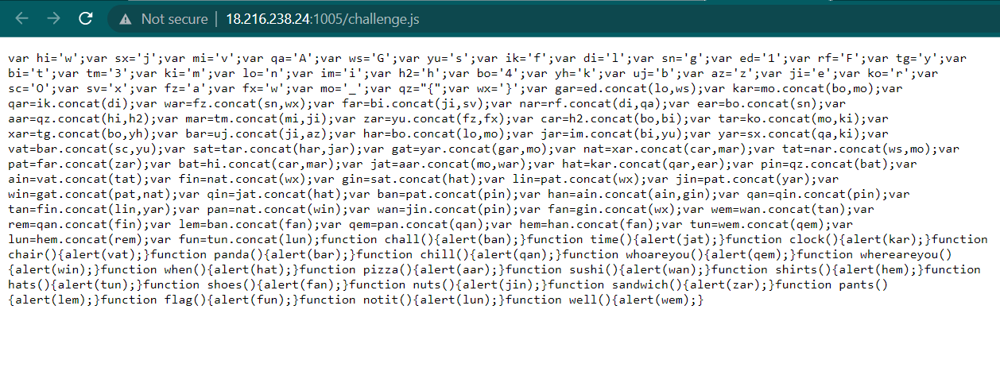

# Console Scrabble
> Solve the puzzle using web development basics.

## About the Challenge
We have been given a very simple website, and upon checking the source code of the website, we found that it has only one JavaScript file



## How to Solve?
To solve this challenge, I called every JavaScript function listed in that file, such as `flag()` or `whoareyou()`. Surprisingly, I found the flag when I called the `pants()` function.


```
texsaw{wh4t3ver_m4n_its_4_fl4g}
```