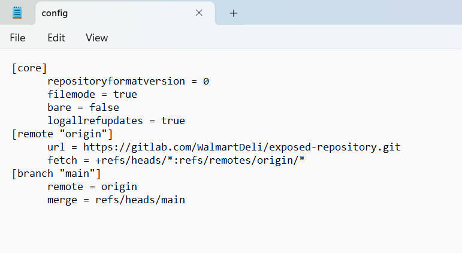

# Git er' done
> I've made my first website but I still have a lot of tasks to do. Can you check it out and give me some feedback?

## About the Challenge
We have been given a very simple website that contain To-Do list


## How to Solve?
Because the title of the challenge is about `git`. So I accessed `.git/config` endpoint and we got the git config



I went to https://gitlab.com/WalmartDeli/exposed-repository.git and then there is a file called `flag.txt`


```
texsaw{0h_n0_my_g1t_15_3xp053d!}
```