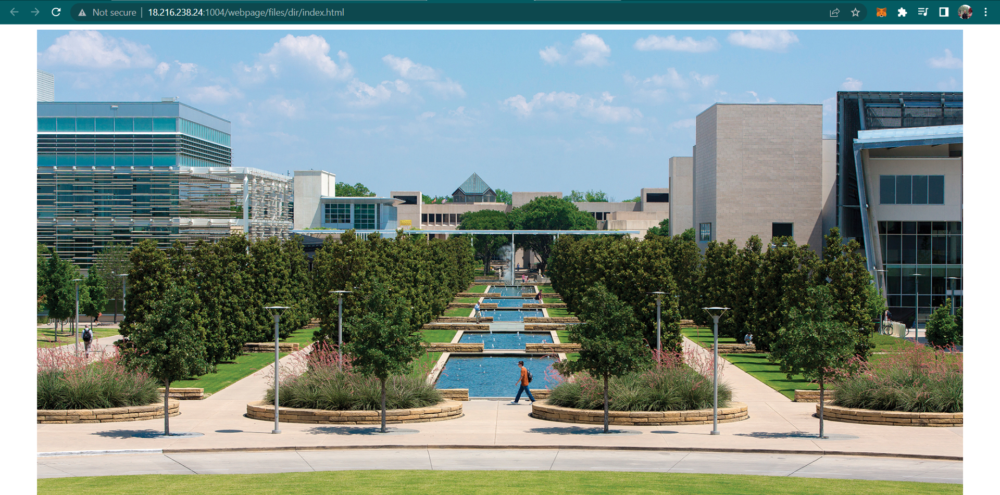

# MIT of The South
> Welcome to UTD! We like to call ourselves the MIT of the South (not really). The flag for this challenge is hidden in one of the classrooms, can you find it?

## About the Challenge
We have been given a very simple website that contains only 1 image



## How to Solve?
First I checked some interesting files for example `sitemap.xml` or `robots.txt`. And I found there is a `robots.txt` file


After getting a little stuck, I decided to check `tobors.txt` and luckily, I obtained a list of endpoints.


I manually checked the endpoints one by one but the response is always `There's nothing written on the board`. So I used `ffuf` here

```shell
ffuf -w endpoints.txt:FUZZ -u http://18.216.238.24:1004/webpage/files/dirFUZZ -fl 29
```


The flag was located in `/ecss/4.910`


```
texsaw{woo0OOo0oOo00o0OOOo0ooo0o00Osh}
```