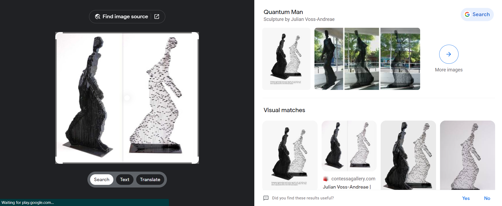
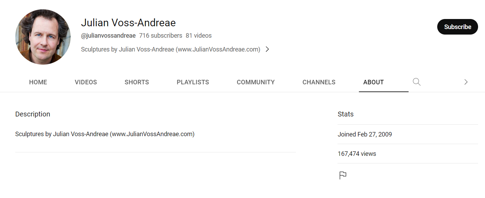

# Superhuman Intuition
> Alice: "Now I am not sure who made this sculpture, but just from looking at it, I can tell that the artists has a YouTube channel. Not only that, I can tell you the exact date they created their channel!"

> Bob: "Impossible! There is no way that you can deduct all that information from just glancing at a sculplture!"

> Alice: "Oh yes I can Bob, and I will tell you the date right now. The artist created their YouTube channel on..."

> Note: The flag will be the date that the artist created their YouTube channel. The flag's format is texsaw{mm-dd-yyyy}.

## About the Challenge
We have been given an image of a sculpture. First, we need to determine the artist who created the sculpture, and then we need to find their YouTube channel.


## How to Solve?
To know who made the sculpture, im using `Google Reverse Image`



The artist name is `Julian Voss-Andreae`. So I tried to find his youtube channel by searching his name on Google


We found his Youtube channel. If we want to know when the artist created his Youtube channel, we can check in the `About` menu



```
texsaw{02-27-2009}
```