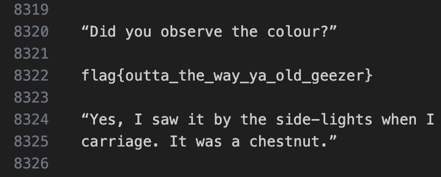

# Back In My Day
> Back in my day sharing files was a lot harder!!!

## About the Challenge
We were given a pcapng file where each steam contain UUencoded messages


## How to Solve?
So I made another python script to decode the messages (There's decoder online, but because the size was large, so I decided to create another python script to solve this)

```python
import uu
import io

def decode_uuencoded_file(file_path):
    with open(file_path, 'rb') as file:
        uuencoded_data = file.read()

    decoded_file = uu.decode(io.BytesIO(uuencoded_data))

    return decoded_file[0]

file_path = 'file.txt'
decoded_data = decode_uuencoded_file(file_path)

if decoded_data:
    print("Decoded data:")
    print(decoded_data.decode('utf-8'))
```

So, the flow will looks like this

```
check the stream (Ex: first stream) -> copy manually into file.txt -> decode -> next stream -> repeat
```

And the flag was located in stream 55



```
flag{outta_the_way_ya_old_geezer}
```