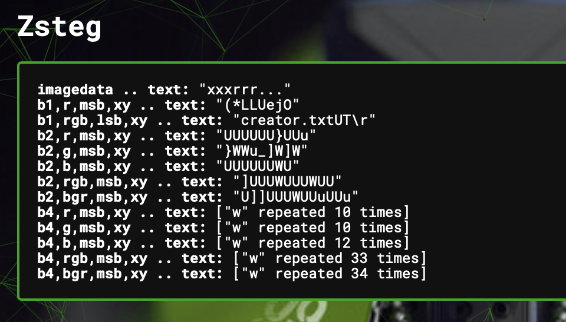

# funding secured
> Someone in our company leaked some very sensitive information. We absolutely cannot let this stand.

> Thankfully our monitoring software intercepted the screenshot that was leaked. An old engineer of ours did write some kind of watermarking for screenshots but we have no idea how it works. Can you figure it out?

## About the Challenge
We were given an image (You can download the image [here](captured.png)) and when I scanned the image using Aperisolve, I found something interesting in the `zsteg` output



## How to Solve?
So, I believe there's a file inside this image. Initially, I tried using `binwalk` to extract the file, but failed. It seems like we need to use LSB steganography to extract the file.

So I used this [website](https://stegonline.georgeom.net/extract) and then, using the `Extract Data` feature voilà! I found a ZIP file.


But when I extracted it, I only got 2 files: `exif.txt` and `creator.txt`, But in the ASCII text, there's another file called `flag.txt`. So I decided to use CyberChef and then use `Extract LSB` option


Download the zip file and then read `flag.txt` file

```
flag{what_came_first_the_stego_or_the_watermark}
```