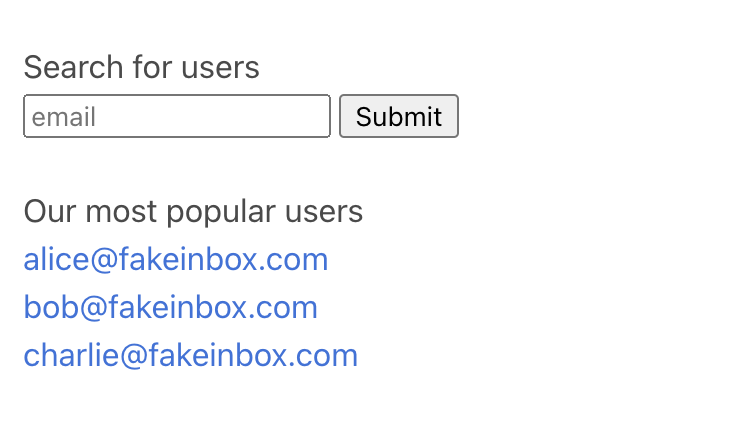
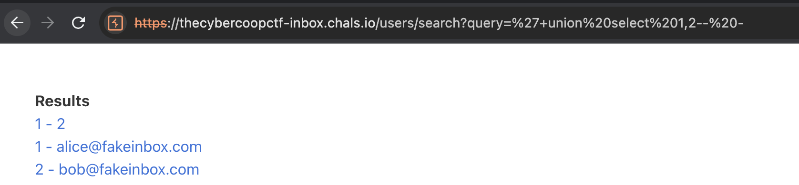
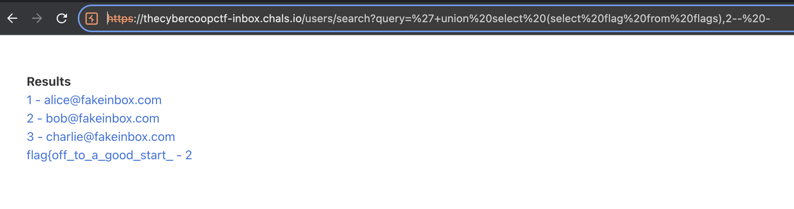
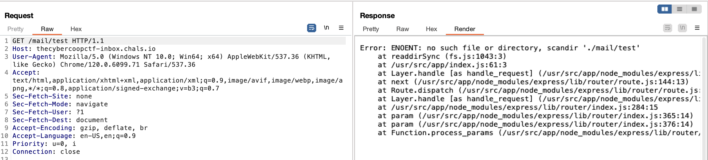
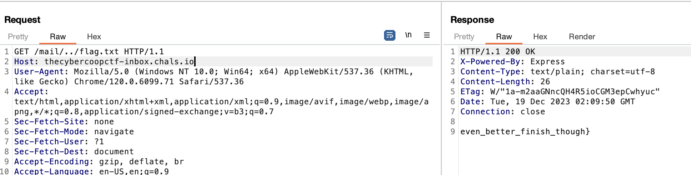

# inbox
> I heard this email server has two halves of a whole flag in it!

## About the Challenge
We were given a website without the source code and there are some functionality such as:
* Search users
* Read an email



## How to Solve?
If there's a search feature in this website, the first vulnerability that comes to my mind is SQL injection. First, I tried UNION-based SQL injection:



As we can see here, the website is vulnerable to SQL injection. In order to obtain the flag, we need to read a `flags` table using this payload."

```
' UNION SELECT (SELECT flag from flags),2-- -
```



We got the first path! And now we need to get the second part.There's a path traversal vulnerability in `/mail/` endpoint. When I tried a random string (Ex: `/main/test`). The output:



To obtain the second part of the flag, we can use the `../flag.txt`



```
flag{off_to_a_good_start_even_better_finish_though}
```