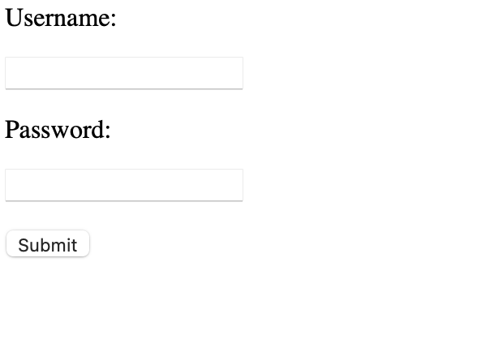

# secure router
> My friend bought this router. I want to hack into it so bad.

> The firmware for the router is online. There's gotta be bugs in it...

## About the Challenge
We were given a website and also a squashfs filesystem




## How to Solve?
There are 5 perl code in `var/www/` directory


To obtain the flag, we need to acquire the credentials first and then log in. To retrieve the credentials, we can use `MCU_recover_credentials.pl` and `MCU_serial_forgot_password.pl`. Here is the content of `MCU_recover_credentials.pl`: 

```perl
...
$timestamp = strftime("%j%m%H%M%Y", localtime);

open(FH,"username.txt") or &dienice("Can't open username.txt: $!");
$username = <FH>;
close(FH);

open(FH,"password.txt") or &dienice("Can't open password.txt: $!");
$password = <FH>;
close(FH);

print "Content-type:text/html\r\n\r\n";

if ($FORM{id} ne $timestamp){
    print "<html>";
    print "<head>";
    print "<title>Secure Router</title>";
    print "</head>";
    print "<body>";
    print "<center><p>Sorry, your timestamp nonce has expired</p></center>";
    print "</body>";
    print "</html>";
    exit 0;
}

print "<html>";
print "<head>";
print "<title>Secure Router</title>";
print "</head>";
print "<body>";
print "<p>Password recovered</p>";
print "<p>$username</p>";
print "<p>$password</p>";
print "</body>";
print "</html>";
```

We need to provide the correct nonce / timestamp to recover the credential. And to get the correct nonce, we can use `MCU_serial_forgot_password.pl` because the code leaked the nonce


Copy the `nonce` and paste it into the `id` parameter of the `MCU_recover_credentials.pl`file.


Use the credentials to log in to the website.


```
flag{based_on_a_true_router_cve_story}
```