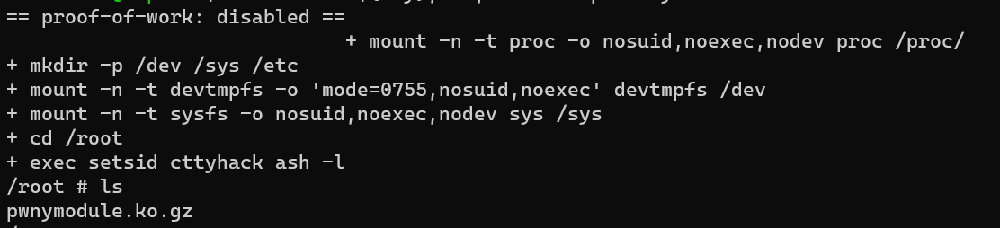
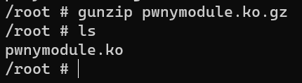
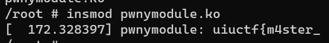
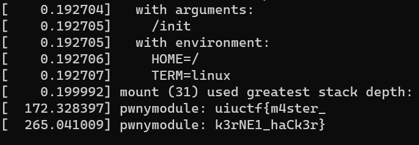

# Corny Kernel
> Use our corny little driver to mess with the Linux kernel at runtime!

> $ socat file:$(tty),raw,echo=0 tcp:corny-kernel.chal.uiuc.tf:1337

## About the Challenge
We have been given a `c` file called `pwnymodule.c` and here is the content of `pwnymodule.c`

```c
// SPDX-License-Identifier: GPL-2.0-only

#define pr_fmt(fmt) KBUILD_MODNAME ": " fmt

#include <linux/module.h>
#include <linux/init.h>
#include <linux/kernel.h>

extern const char *flag1, *flag2;

static int __init pwny_init(void)
{
	pr_alert("%s\n", flag1);
	return 0;
}

static void __exit pwny_exit(void)
{
	pr_info("%s\n", flag2);
}

module_init(pwny_init);
module_exit(pwny_exit);

MODULE_AUTHOR("Nitya");
MODULE_DESCRIPTION("UIUCTF23");
MODULE_LICENSE("GPL");
MODULE_VERSION("0.1");
```

This code is a basic linux kernel module. This code will print the first part of the flag when the module is loaded

```c
static int __init pwny_init(void)
{
	pr_alert("%s\n", flag1);
	return 0;
}

...

module_init(pwny_init);
```

And the code will print the second part of the flag when the module is unloaded

```c
static void __exit pwny_exit(void)
{
	pr_info("%s\n", flag2);
}

...

module_exit(pwny_exit);
```

And in this chall, we need to connect to the server and inside the server there is 1 file called pwnymodule.ko.gz



## How to Solve?
First, we need to gunzip the file first using `gunzip` command

```bash
gunzip pwnymodule.ko.gz
```



And then we need to load this module inside the server using `insmod` command

```bash
insmod pwnymodule.ko
```



As you can see we have the first part of the flag, and then we need to unload the module using `rmmod` command

```
rmmod pwnymodule.ko
```

And then print the kernel messages by using `dmesg` command to obtain the second part of the flag



```
uiuctf{m4ster_k3rNE1_haCk3r}
```