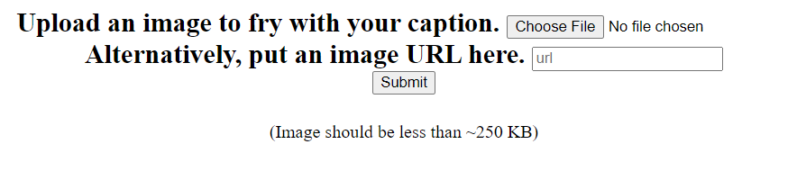
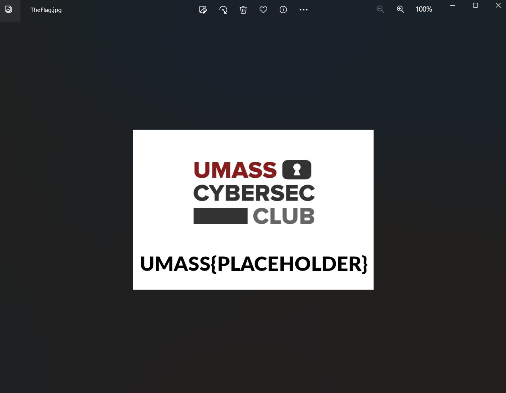
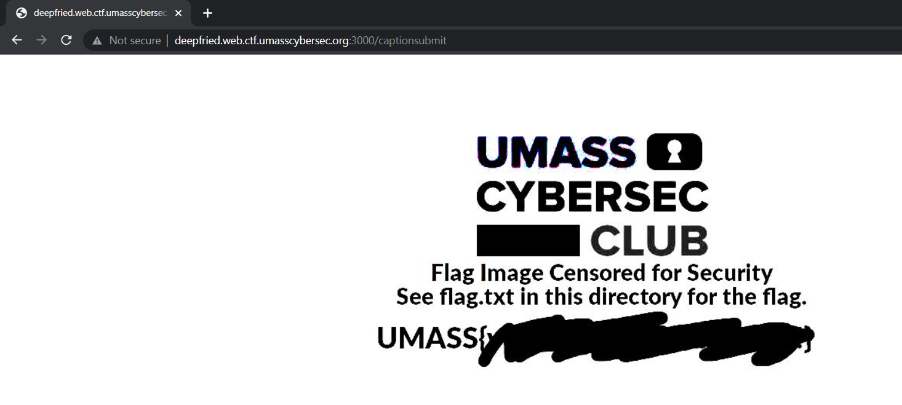
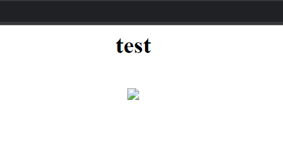

# Deepfried
> `-`

## About the Challenge
We have been given a source code (You can download the file [here](DeepFried.zip))



## How to Solve?
If we check the the source code, we will see there is a folder called `restriced_memes` and inside the folder there is an image called `TheFlag.jpg` so I'm assumming we need to access `/restricted_memes/TheFlag.jpg` to obtain the flag



But we can't access that endpoint directly because that endpoint can only be accessed locally.

```javascript
router.all('/restricted_memes/:img', async (req,res, next)=>{
    if(req.ip === '::ffff:127.0.0.1') {
        next();
    } else {
       return res.status(403).send("Unauthorized Request");
    }
})
```

So, the idea here. We need to input `http://127.0.0.1:3000/restricted_memes/TheFlag.jpg` in the `Image URL` form



As we can see in the image, the flag was located in `flag.txt` directory. So we need to input `http://127.0.0.1:3000/restricted_memes/flag.txt` in the `Image URL` form



Press `CTRL + U` to check the source code


You will see there is a Base64 string in `img` tag. Decode the msg using `Base64` Decoder to obtain the flag

```
UMASS{v@Mo$_APr0nTaR_1!i!I!}
```