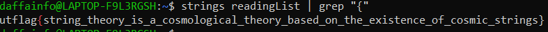

# Reading List
> I created this binary to keep track of some strings that I want to read. I thought I put a CTF flag in it so I'll remember to make a problem for UTCTF, but I can't seem to find it...

## About the Challenge
We have been given a file to reverse (You can download the file [here](readingList))

## How to Solve?
To get the flag you can use grep and then find string that contains `{`



```
utflag{string_theory_is_a_cosmological_theory_based_on_the_existence_of_cosmic_strings}
```