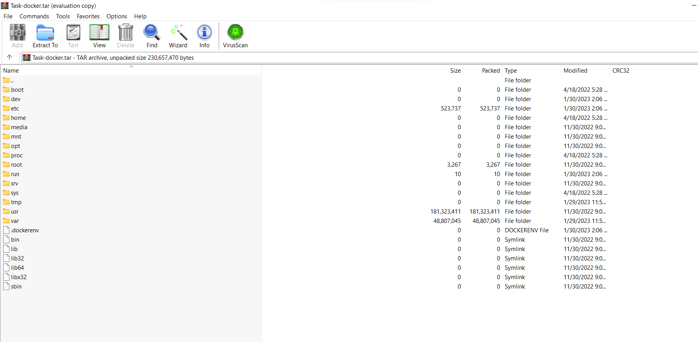
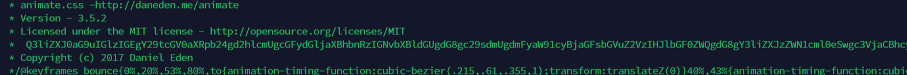

# Docker Web
`-`

## About the Challenge
We are given a zip code that contain linux directories



## How to Solve?
Open the `index.html` file on `/var/www/html` directories and you will notice there is a base64 encoded msg in line `21`



And if you decode it, you will get the flag

```
vu-cyberthon-23
```