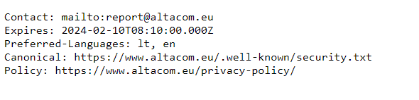

# RFC standard for security policy information
> The Lithuanian company Altacom uses one of the latest RFC standard formats for presenting security p...

## About the Challenge
We need to know the email that company use to receive vulnerability report

## How to Solve?
After finding about Altacom company on google, I found the official website (https://www.altacom.eu/). And if we want to know the email that company use to receive vulnerability report, you can access `/.well-known/security.txt` endpoint



```
report@altacom.eu
```