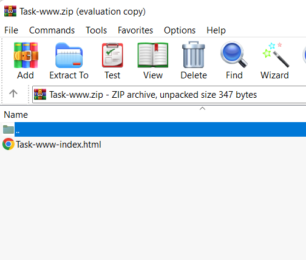
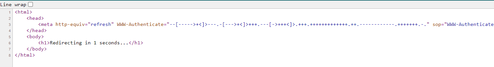

# Simple Web
`-`

## About the Challenge
We are given a zip code that contain HTML file inside of it



## How to Solve?
If we open the HTML file and check the source code, you will found brainfuck language



And if you decode it, you will get the flag

```
cyberthon
```