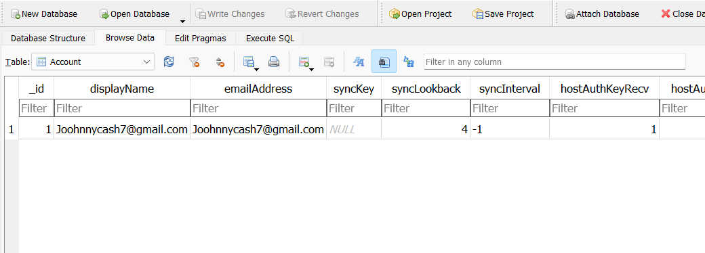

# What email address is setup on com.android.email service
> What email address is setup on com.android.email service?

## About the Challenge
We need to find the email address that set up on com.android.email

## How to Solve?
We need to find the email by get the SQLite Database first from `/root/data/com.android.email/databases/Emailprovider.db`


Open the SQLite database using `DB Browser for SQlite` and import the database. In the `Account` table, we can see the email



```
Joohnnycash7@gmail.com
```