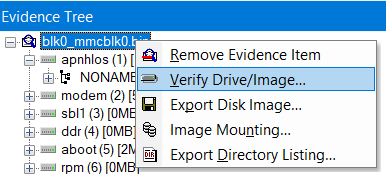

# What is SHA1 checksum of image file blk0_mmcblk0.bin
> What is SHA1 checksum of image file blk0_mmcblk0.bin?

## About the Challenge
We need to get the SHA1 checksum of the image file

## How to Solve?
Im using FTK Imager to get the SHA1 checksum by using `Verify Drive / Image` function



```
5377521a476be72837053390b24bc167d8f9182c
```