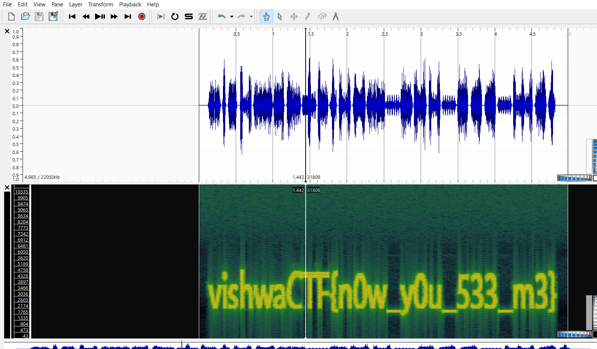

# Can you see me?
> A magician made the seven wonders disappear. But people claim they can still feel their presence in the air.

## About the Challenge
We have been given an image (You can download the file [here](havealook.jpg))

## How to Solve?
In this case im using `binwalk` to know if there is another file inside that image. There result is there is a `zip` file


And then I tried to open the zip file to see if there is a flag or not in that file


There is a `wav` file. Extract it and open that file using Sonic Visualizer -> Spectogram to read the flag



```
vishwaCTF{n0w_y0u_533_m3}
```