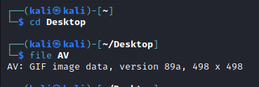

# Guatemala
> My friend wanted to install an antivirus for his computer, but the creator of the antivirus was caught!

## About the Challenge
We have been given a file without any extension (You can download the file [here](AV))

## How to Solve?
Im using `file` command first to know what is the type of the file



As we can see, that file is a GIF file, so I added the `.gif` extension to the file.


I tried to check the metadata first using `exiftool` command


There is a Base64 msg in the `Comment`. Decode it and you will obtain the flag


```
vishwaCTF{pr073c7_ur_3X1F}
```