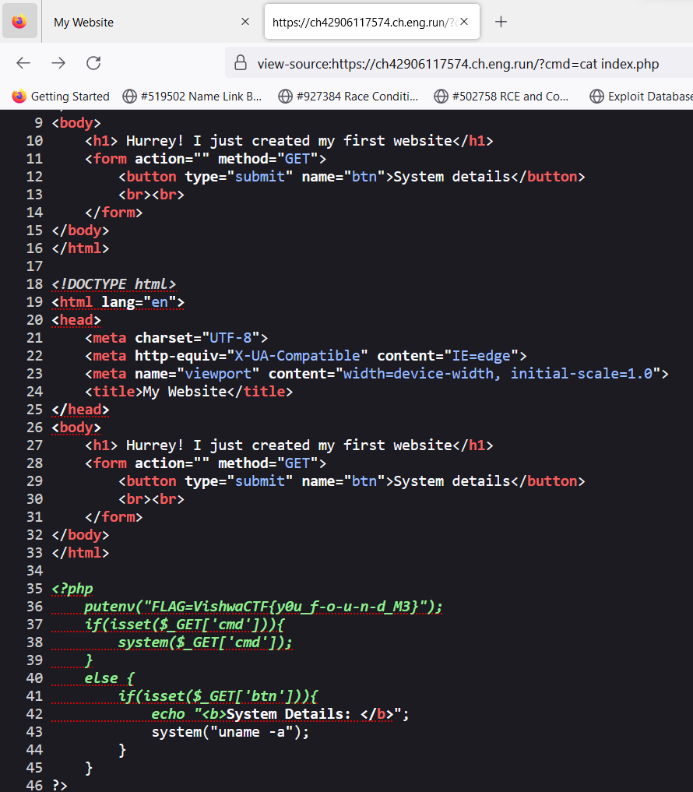

# Payload
> No description.

## About the Challenge
We have been given a website that has a button to give us a detail about the system


## How to Solve?
When I want to check the source code, trying every single thing on the `btn` parameter. The result is nothing. And then I decided to test some interesting endpoint like `.git` or `robots.txt`. And then there is a source code when I open `robots.txt`


As you can see, we can execute an OS command using the `cmd` parameter. And then read `index.php` file to obtain the flag or we can execute the `env` command to retrieve the flag from environtment variables



```
VishwaCTF{y0u_f-o-u-n-d_M3}
```