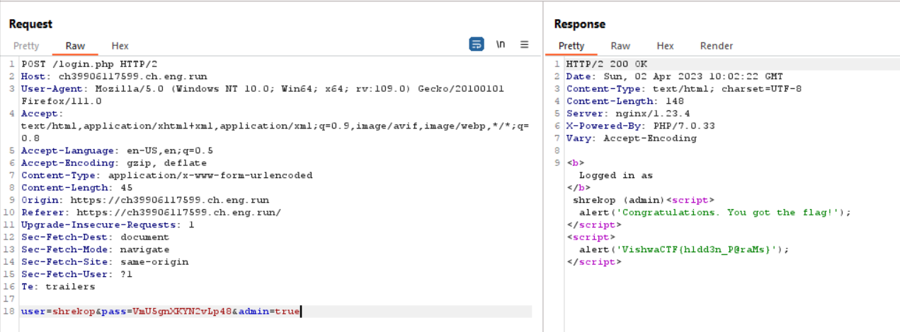

# spooky
> I forgot my login credentials again!!

## About the Challenge
We have been given a website that has a login form


## How to Solve?
I have trying every single payload to bypass the admin login (SQL and NoSQL) and the result is nothing. And then my friend, @DimasMaulana found an interesting endpoint called `sitemap.xml`


As you can see, we found another endpoint that contain users and password.

### User:
```
user
guest
root
admin
kali
raspberry
support
fiona
charles
alice
pinocchio
shrekop
dragon
donkey
wolf
```

### Pass:
```
R4YPLtCnaMc8GhWy
fX9maZjLNdqKG8wH
r6GUEungvhXqVFyY
WZLNBAdkXc6Yu8rh
ny7Z2jpMT36CBwLH
VmU5gnXKYN2vLp48
VGUtajxuq6KeNk5J
XZTEVmd6AcFN3j84
ydfkG8YS7WMwpQNC
emcYJrGFVMakw5UN
G9fBSNbgmhTduKEU
KctkRurdy4vSMGWF
Ggc6qyrVdDzWhEea
DKaYNZug9ELCzRAy
NwCGR69ZceHu8tmT
```

Im using that username and password wordlist to bruteforce the form and we got 1 correct combination

```
User: shrekop
Pass: VmU5gnXKYN2vLp48
```

Now we can login to the web, but we still didn't get the flag.


As you can see the role is `user`. We need to do privilege escalation from `user` to `admin` roles. To do that, when we login to the website, add `admin` parameter and the value is `true`



```
VishwaCTF{h1dd3n_P@raMs}
```