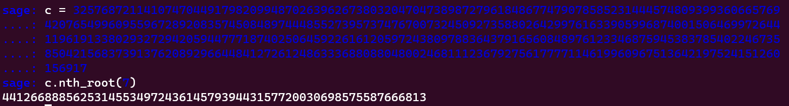

# EZDORSA_Lv2
> What? e is too small?

## About the Challenge
We were given a zip file (You can download the file [here](cry-EZDORSA-Lv2.zip)). There are 2 files inside the zip file, `chall.py` and `out.txt`. Here is the content of `chall.py`

```python
from Crypto.Util.number import bytes_to_long, getPrime, long_to_bytes

p = getPrime(1024)
q = getPrime(1024)
n = p * q
e = 7

m = b"FAKE{DUNMMY_FLAG}"

c = pow(bytes_to_long(m), e, n)
c *= pow(5, 100, n)

print(f"n = {n}")
print(f"e = {e}")
print(f"c = {c}")
```

The code generates two 1024-bit prime numbers, `p` and `q`, multiplies them to obtain the modulus n, and sets the encryption exponent e to 7. It then encodes the message "FAKE{DUNMMY_FLAG}" as a long integer using the bytes_to_long function and raises it to the power of e modulo n to obtain the ciphertext `c`. Finally, the code multiplies `c` by 5^100 modulo n. This multiplication is a simple form of blinding that is meant to hide the original plaintext and make it harder for an attacker to factorize n and recover the original message. The values of `n`, `e`, and `c` are then printed.

And here is the content of `out.txt`

```
n = 25465155563758206895066841861765043433123515683929678836771513150236561026403556218533356199716126886534636140138011492220383199259698843686404371838391552265338889731646514381163372557117810929108511770402714925176885202763093259342499269455170147345039944516036024012941454077732406677284099700251496952610206410882558915139338028865987662513205888226312662854651278789627761068396974718364971326708407660719074895819282719926846208152543027213930660768288888225218585766787196064375064791353928495547610416240104448796600658154887110324794829898687050358437213471256328628898047810990674288648843902560125175884381
e = 7
c = 25698620825203955726406636922651025698352297732240406264195352419509234001004314759538513429877629840120788601561708588875481322614217122171252931383755532418804613411060596533561164202974971066750469395973334342059753025595923003869173026000225212644208274792300263293810627008900461621613776905408937385021630685411263655118479604274100095236252655616342234938221521847275384288728127863512191256713582669212904042760962348375314008470370142418921777238693948675063438713550567626953125
```

## How to Solve?
We need to find the real value of the ciphertext, in this case i'll be using `gmpy2` package

```python
import gmpy2

n = 25465155563758206895066841861765043433123515683929678836771513150236561026403556218533356199716126886534636140138011492220383199259698843686404371838391552265338889731646514381163372557117810929108511770402714925176885202763093259342499269455170147345039944516036024012941454077732406677284099700251496952610206410882558915139338028865987662513205888226312662854651278789627761068396974718364971326708407660719074895819282719926846208152543027213930660768288888225218585766787196064375064791353928495547610416240104448796600658154887110324794829898687050358437213471256328628898047810990674288648843902560125175884381

gmpy2.get_context().precision = 2048
n = gmpy2.mpz(n)
mod_exp = gmpy2.powmod(5, 100, n)
c /= mod_exp
print(c)
```


Now, use `sage` command and use `nth_root` to find n-th root of the given number



Now, go to python3 again and run this code. This code converts `c` to a string of hexadecimal digits, then converts those digits back to a string of bytes, and finally decodes those bytes to a human-readable string.

```python
bytes.fromhex(hex(441266888562531455349724361457939443157720030698575587666813)[2:]).decode()
```


```
FLAG{l0w_3xp0n3nt_4ttAck}
```