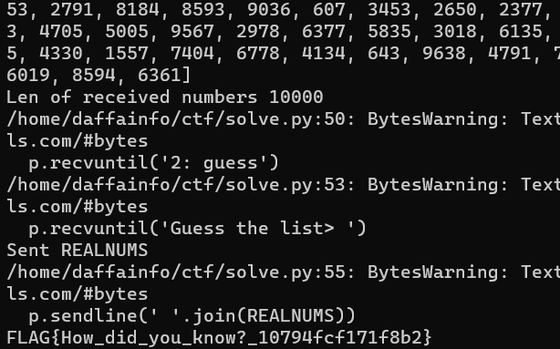

# Guess
> Guess the numbers 🤔

> nc guess-mis.wanictf.org 50018

## About the Challenge
We have been given a server to connect an a zip file (You can download the file [here](mis-guess.zip)). There is a file called `chall.py`. Here is the content of `chall.py`

```python
import os
import random

ANSWER = list(range(10**4))
random.shuffle(ANSWER)
CHANCE = 15


def peep():
    global CHANCE
    if CHANCE <= 0:
        print("You ran out of CHANCE. Bye!")
        exit(1)
    CHANCE -= 1

    index = map(int, input("Index (space-separated)> ").split(" "))
    result = [ANSWER[i] for i in index]
    random.shuffle(result)

    return result


def guess():
    guess = input("Guess the numbers> ").split(" ")
    guess = list(map(int, guess))
    if guess == ANSWER:
        flag = os.getenv("FLAG", "FAKE{REDACTED}")
        print(flag)
    else:
        print("Incorrect")


def main():
    menu = """
    1: peep
    2: guess""".strip()
    while True:
        choice = int(input("> "))
        if choice == 1:
            result = peep()
            print(result)
        elif choice == 2:
            guess()
        else:
            print("Invalid choice")
            break
```

This Python script is a simple guessing game where the player must guess a random sequence of 10,000 numbers that have been shuffled using the `random.shuffle`. The player has 15 chances to view a subset of the shuffled numbers before submitting a guess. The script uses the `input()` function to prompt the player for input and the `print()` function to display the result. If the player correctly guesses the entire sequence, the script will output the value of the environment variable `FLAG`, which presumably contains the flag for the challenge. Otherwise, the script will output the message `Incorrect`. The main function uses a while loop to continually prompt the player for their choice of action, which can be to peep (view a subset of the shuffled numbers) or to guess the entire sequence.

## How to Solve?
This chall is literally same with `K3RN3LCTF: Bogo Solve` (You can access the writeup [here](https://ctftime.org/writeup/31333)). Here is the code I used to solve this chall

```python
from pwn import *
from collections import Counter
# context.log_level='debug'

def createListNum(begin, offset = 1000):
    finalList = []
    for currentNum in range(begin, begin + offset):
        for num in range(begin, currentNum + 1):
            finalList.append(str(num))
    return ' '.join(finalList)
    # return finalList

def getKey(dict, value):
    return list(dict.keys())[list(dict.values()).index(value)]

p = remote('guess-mis.wanictf.org', 50018)
# Payload will be sent in the final request
REALNUMS = []
begin = 0

while begin != 10000:
    p.recvuntil('2: guess')
    # Send command 1
    p.sendline(bytes('1', 'utf-8'))
    p.recvuntil('index> ')
    print("Sent from", begin)
    # Send request
    request = createListNum(begin)
    p.sendline(request)

    # Receive response
    # Example response: Stolen: [5219, 1111, ..., 1]
    numList = p.recvline().strip().decode('utf-8')
    print("Received", numList)
    numList = numList.split('[')[1][:-1].split(', ')
    # Convert to dict
    response = Counter(numList)

    # Put into our payload
    for currentNum in range(begin, begin + 1000):
        key = currentNum % 1000
        REALNUMS.append(getKey(response, 1000 - key))

    print("Len of received numbers", len(REALNUMS))
    # New request
    begin += 1000
    if len(REALNUMS) == 10**4:
        break

p.recvuntil('2: guess')
# Send command 2
p.sendline(bytes('2', 'utf-8'))
p.recvuntil('Guess the list> ')
print("Sent REALNUMS")
p.sendline(' '.join(REALNUMS))

# Receive flag
print(p.recvline().strip().decode('utf-8'))

p.close()
```



```
FLAG{How_did_you_know?_10794fcf171f8b2}
```