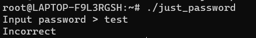
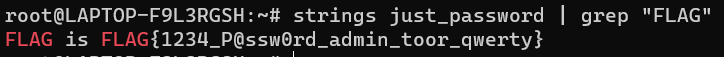

# Just_Passw0rd
> ELF file can be executed by typing ./just_password in WSL or Linux.

> In this challenge, The ELF file requires password. Is there a way to look inside without knowing the password?

## About the Challenge
We have been given a compiled file (You can download the file [here](just_password)). We need to know the password of the file to obtain the flag



## How to Solve?
To obtain the flag we need to use `strings` and `grep` command. And the command I used to read the flag was

```shell
strings just_password | grep "FLAG"
```



```
FLAG{1234_P@ssw0rd_admin_toor_qwerty}
```