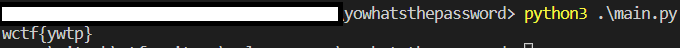

# yowhatsthepassword
> hey I lost the password :(

## About the Challenge
We have been given a source code (You can download the file [here](main.py)). Here is the content of the source code
```python
# I'm thinking of a number from 0 to 2^32 - 1
# Can you guess it?

import random

def generate(seed):
  random.seed(seed)
  c = 0
  while c != ord('}'):
    c = random.randint(97, 126)
    print(chr(c), end='')
  print()

secret = 'ly9ppw=='

import base64

s = int(input("password? >>> "))

if int(base64.b64decode(secret).hex(), 16) == s:
  generate(s)
else:
  print('nope')
```

## How to Solve?
To get the flag we can recode the code like this

```python
import random

def generate(seed):
  random.seed(seed)
  c = 0
  while c != ord('}'):
    c = random.randint(97, 126)
    print(chr(c), end='')
  print()

secret = 'ly9ppw=='

import base64

generate(int(base64.b64decode(secret).hex(), 16))
```

I removed the `input()` function, so we don't need to guess the flag anymore. Just run the code and the flag will appear on the terminal



```
wctf{ywtp}
```